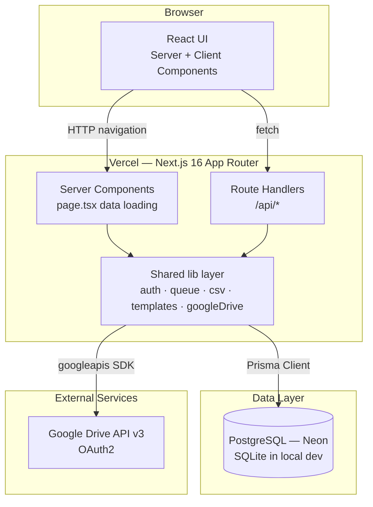
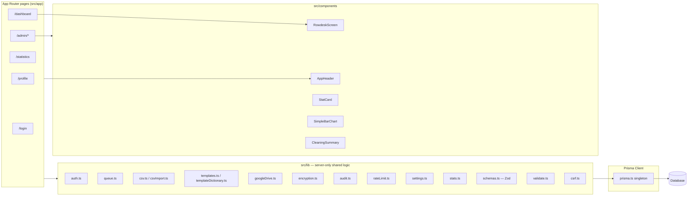
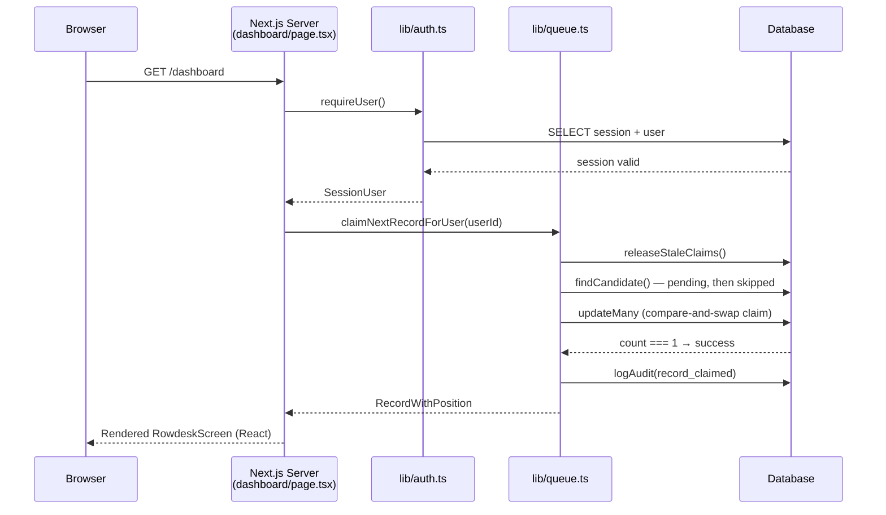
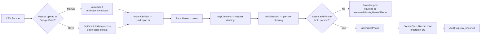
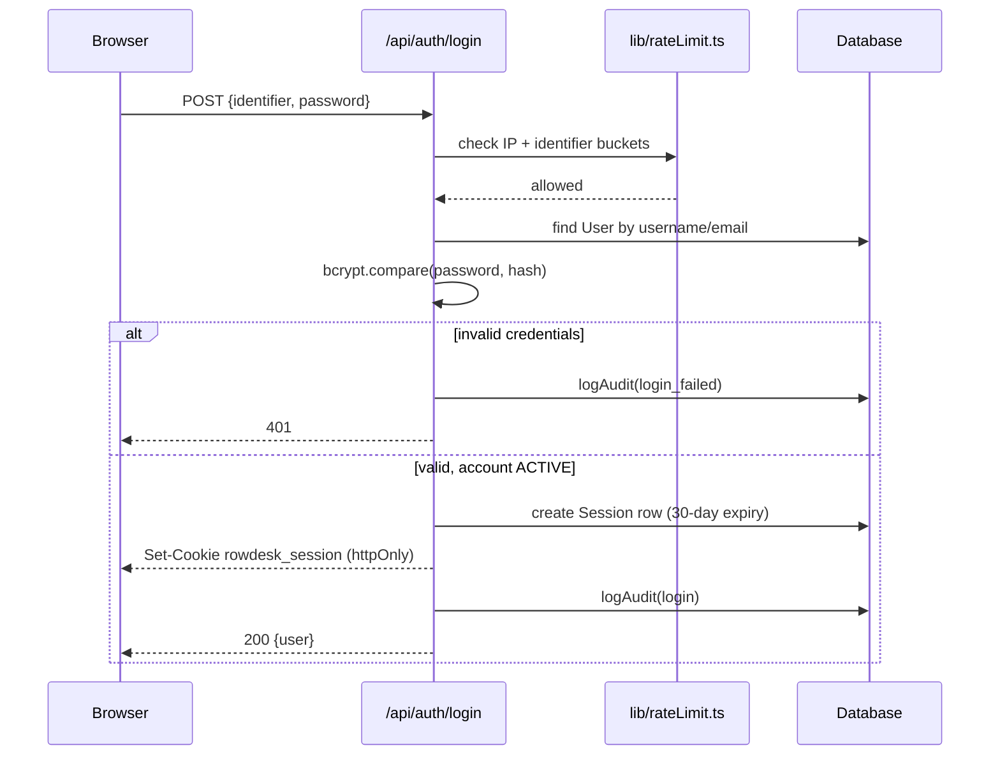
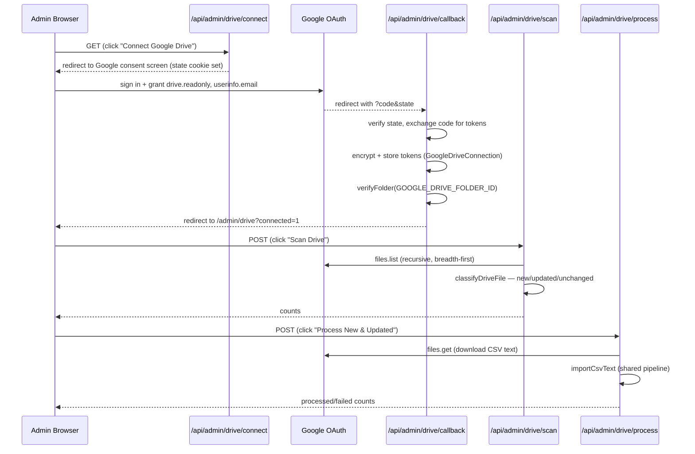
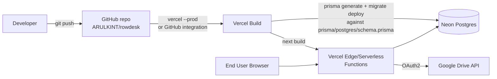

# 03 — System Architecture

## 1. Architecture Style

Rowdesk is a **monolithic full-stack Next.js application** (App Router). There is no separate backend service — Server Components, Route Handlers (the API), and the database client all run inside the same Next.js build and deploy as one Vercel project. There are no queues, caches, workers, or microservices.

## 2. High-Level Architecture

## 3. Component Architecture

## 4. Request Lifecycle (Dashboard Claim Example)

The compare-and-swap `updateMany({ where: { id, claimedById: null }, data: { claimedById: userId } })` is what guarantees exclusivity: if two requests race for the same record, only one `updateMany` call affects a row (`count === 1`); the loser retries against the next candidate.

## 5. Data Flow — CSV Ingestion

## 6. Authentication Flow

Every subsequent request re-validates the session server-side by looking up the `Session` row (see [14-authentication-security.md](14-authentication-security.md)) — there is no stateless JWT to trust blindly, so revoking a session (e.g. a password reset) takes effect immediately.

## 7. Google Drive OAuth & Ingestion Flow

## 8. Deployment Architecture

See [18-deployment.md](18-deployment.md) for the full build-command and environment-variable breakdown.

## 9. Component Communication Summary

| From | To | Mechanism |
|---|---|---|
| Browser | Server Components | Standard HTTP navigation (SSR) |
| Client Components (`"use client"`) | Route Handlers | `fetch()` to `/api/*`, JSON in/out |
| Route Handlers / Server Components | Database | Prisma Client (`src/lib/prisma.ts` singleton) |
| Route Handlers | Google Drive | `googleapis` SDK, OAuth2 client (`src/lib/googleDrive.ts`) |
| Any mutating Route Handler | Audit trail | `logAudit()` writes an `AuditLog` row synchronously in the same request |

## 10. Architecture Patterns & Design Decisions

| Pattern | Where it appears | Why it's used | Trade-off |
|---|---|---|---|
| **Server-Components-first, API-only-where-needed** | `src/app/**/page.tsx` fetch directly via Prisma; `src/app/api/**` exists only for client-triggered mutations and the OAuth callback | Avoids a redundant "fetch an API that itself just queries the database" round-trip for every read-heavy admin page | Business logic ends up split between page components (reads) and route handlers (writes) rather than living behind one uniform API surface |
| **Thin Route Handlers over a shared `lib` layer** | Every `route.ts` is a short auth-check + validate + delegate to `src/lib/*` | Keeps the actual business logic (claim algorithm, cleaning rules, template composition) unit-testable in isolation, without needing an HTTP server in the test | The route handlers themselves are consequently under-tested relative to the logic they call — see [17-testing.md](17-testing.md) and [24-known-issues.md](24-known-issues.md) |
| **Compare-and-swap concurrency control, not row locking** | `claimNextRecordForUser()` | Portable across SQLite (dev/test) and PostgreSQL (prod) without relying on a database-specific `SELECT ... FOR UPDATE` | Requires an explicit bounded retry loop (5 attempts) rather than the database blocking automatically |
| **Defense-in-depth authorization** | `requireUser()`/`requireAdmin()` (Server Components) **and** `getApiUser()` + role check (Route Handlers) | Neither layer alone is sufficient — a Server Component guard doesn't protect a directly-called API, and an API-only guard would still server-render protected page content before the check ran | Some duplication of the "is this an admin" check across the codebase |
| **Two Prisma schemas, one shared model definition** | `prisma/schema.prisma` (source) → `prisma/postgres/schema.prisma` (generated mirror) | SQLite locally (no external service needed to develop) without giving up real Postgres in production | Migrations must be manually added to both trees in the correct order — a process step, not something the tooling enforces automatically |
| **No service/repository abstraction layer over Prisma** | `src/lib/*` calls `prisma.*` directly | Prisma's generated client is already a type-safe data-access layer; an additional repository layer would add indirection without a corresponding benefit at this codebase's size | Swapping ORMs would require touching every `src/lib` file directly, rather than one abstraction boundary — accepted as unlikely and low-cost to defer |

None of these are formal named patterns like MVC or Clean Architecture in the textbook sense — Rowdesk is a **Next.js App Router monolith** with a conventional "pages call server-only lib modules which call Prisma" layering, not a deliberately-imposed architectural framework. A single Next.js monolith was the right fit given the actual requirements: one small internal team, one workflow, no need for independent scaling of separate services. This keeps the whole system in one deployable unit with one database connection pool, which is appropriate at this scale.
