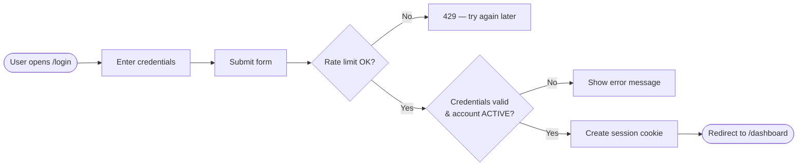
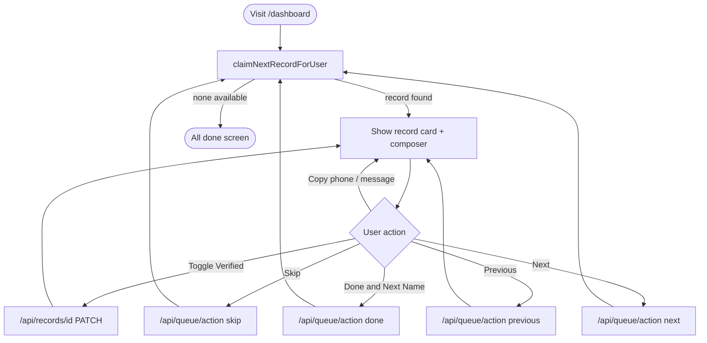
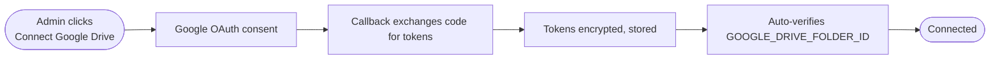

# 07 — User Workflows

Each workflow below follows the same structure: starting condition, user action, system processing, database/API interaction, result, possible errors, end condition.

## 1. Sign In

| Step | Detail |
|---|---|
| **Starting condition** | User has valid credentials, is not signed in |
| **User action** | Enters username-or-email and password on `/login`, clicks Login |
| **System processing** | `POST /api/auth/login` — IP and identifier rate-limit check, credential lookup, `bcrypt.compare` |
| **DB interaction** | `SELECT` on `User` by username/email; on success, `INSERT` into `Session`; `INSERT` into `AuditLog` (`login` or `login_failed`) |
| **Result** | `Set-Cookie: rowdesk_session` (httpOnly, 30-day expiry); client navigates to `/dashboard` |
| **Possible errors** | `401` incorrect credentials; `403` account disabled; `429` too many attempts (20/15min per IP, 8/15min per identifier) |
| **End condition** | User lands on Dashboard with an active claimed record (or the "All done" state) |

## 2. Work a Lead (the core workflow)

| Step | Detail |
|---|---|
| **Starting condition** | User is signed in, visits `/dashboard` |
| **User action** | Reviews Name/Rating/Phone/Map/Website, optionally clicks Copy (phone), Verified (opens Maps), Open (website), cycles templates, clicks Copy message |
| **System processing** | On page load: `claimNextRecordForUser()` atomically claims a record. Every button click is a small `fetch()` to `/api/records/[id]` (toggle) or `/api/queue/action` (skip/done/next/previous) |
| **DB interaction** | Compare-and-swap `updateMany` on claim; `UPDATE` on toggle/status change; `INSERT` into `AuditLog` for every claim/skip/done/release |
| **Result** | Record status becomes `done` (permanent) or `skipped` (returns to pool), or the claim simply moves to the next/previous record |
| **Possible errors** | `409` if the record's ownership changed underneath the user (e.g. a stale claim was reassigned); network failure shows a toast ("Couldn't save — try again") |
| **End condition** | Either another record is claimed, or the "All done" screen appears when no record is available |

## 3. Manual CSV Import (Admin)

| Step | Detail |
|---|---|
| **Starting condition** | Admin has a `.csv` file of scraped listings |
| **User action** | `/admin/import` → choose file → Import |
| **System processing** | `POST /api/import` (multipart) → `importCsvText()`: Papa Parse → column mapping → per-row cleaning → phone normalization |
| **DB interaction** | `INSERT` one `SourceFile`, `createMany` on `Record`, `INSERT` into `AuditLog` (`csv_imported`) |
| **Result** | Cleaning summary shown (original/removed/final row counts, missing-field counts); redirects to Processing Queue after 2.4s |
| **Possible errors** | `400` if required columns (`name`, `phone`) can't be found, or every row is missing Name/Phone |
| **End condition** | New records enter the shared queue as `pending` |

## 4. Google Drive Ingestion (Admin, one-time setup + ongoing use)

**One-time setup:**

**Ongoing use:**

| Step | Detail |
|---|---|
| **Starting condition** | Drive is connected; new/changed CSVs exist in the configured folder or its subfolders |
| **User action** | Click **Scan Drive**, then **Process New & Updated** |
| **System processing** | Scan: recursive `files.list` across the folder tree, classify each file (new/updated/unchanged) by comparing Drive's `modifiedTime` to the last processed version. Process: downloads and imports every `new`/`updated` file through the same `importCsvText()` pipeline as manual upload |
| **DB interaction** | `DriveFile` rows created/updated per scan; `SourceFile`/`Record` created per processed file; `AuditLog` entries for `drive_scan` and `drive_import` |
| **Result** | New leads enter the shared queue; already-claimed/completed records from a prior version of the same file are untouched (each processed file becomes a **new** `SourceFile` version) |
| **Possible errors** | Per-file failure (e.g. malformed CSV) marks that one `DriveFile` as `status: error` with a message, without blocking the rest of the batch |
| **End condition** | Drive file list shows updated statuses and imported record counts |

## 5. Admin Creates a User

| Step | Detail |
|---|---|
| **Starting condition** | Admin is on `/admin/users` |
| **User action** | Fills name/username/email(optional)/temporary password/role, clicks Create |
| **System processing** | `POST /api/admin/users` — checks for an existing username/email, hashes the password |
| **Result** | New user appears in the table immediately (`router.refresh()`) |
| **Possible errors** | `409` if username/email already taken |
| **End condition** | New user can sign in with the temporary password (should change it via Profile) |

## 6. Admin Manages Outreach Templates

| Step | Detail |
|---|---|
| **Starting condition** | Admin is on `/admin/templates` |
| **User action** | Creates a dictionary, adds template bodies (using `{name}`/`{domain}` placeholders), reorders/retires templates, activates a dictionary |
| **System processing** | Each action is an independent API call (`POST /api/admin/templates`, `PATCH /api/admin/templates/[id]`, `POST /api/admin/dictionaries/[id]/activate`) |
| **Result** | The **active** dictionary's **active** templates immediately populate every user's Dashboard composer on their next page load |
| **End condition** | Exactly one dictionary is active at a time; deactivated/retired templates are hidden from the composer but not deleted |

## 7. Data Processor Reviews Their Own Statistics

Visits `/statistics` → sees completed-today/week/month counts, average per hour, skip count (30d), records still available in the shared queue, and a 14-day bar chart. Read-only, no mutation.

## 8. Admin Reviews Org-Wide Statistics / Audit Log

Visits `/admin/statistics` (filterable by date range, user, source file — totals, per-user performance table, data-quality counts) or `/admin/audit` (filterable by user, action type, free-text search over entity/metadata, paginated 50 rows at a time).
