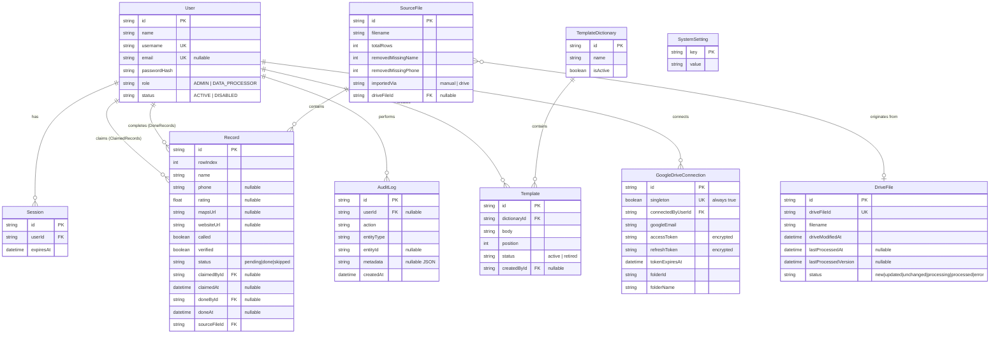

# 10 — Database Documentation

## 1. Overview

Prisma ORM over **SQLite** in local development/tests and **PostgreSQL** (Neon, serverless) in production. Two parallel schema files exist specifically because Prisma's `datasource.provider` is a static string and migration SQL is provider-specific — see [18-deployment.md](18-deployment.md) for why, and how they're kept in sync. The model definitions below are identical between both; only the physical storage differs.

## 2. Entity Relationship Diagram

## 3. Table-by-Table Reference

### `User`

| Column | Type | Notes |
|---|---|---|
| `id` | String (cuid) | PK |
| `name` | String | Display name |
| `username` | String | Unique, login identifier |
| `email` | String? | Unique when present, alternate login identifier |
| `passwordHash` | String | bcrypt, cost 12 |
| `role` | String | `"ADMIN"` \| `"DATA_PROCESSOR"`, default `DATA_PROCESSOR` |
| `status` | String | `"ACTIVE"` \| `"DISABLED"`, default `ACTIVE` |
| `createdAt` / `updatedAt` | DateTime | Auto-managed |

Indexes: `@@index([role])`. Relationships: one-to-many to `Session`, `Record` (as claimer and as completer — two distinct named relations), `AuditLog`, `Template`, `GoogleDriveConnection`.

### `Session`

| Column | Type | Notes |
|---|---|---|
| `id` | String (cuid) | PK — this value **is** the session cookie value |
| `userId` | String | FK → `User`, `onDelete: Cascade` |
| `expiresAt` | DateTime | 30 days from creation |

Index: `@@index([userId])`.

### `SourceFile`

Represents one imported CSV (manual or Drive). Each successful re-import of the *same* Drive file creates a **new** `SourceFile` row (never overwrites), so previously-claimed/completed records from an earlier version are never touched.

| Column | Type | Notes |
|---|---|---|
| `id` | String (cuid) | PK |
| `filename` | String | Original filename |
| `totalRows` | Int | Rows read before cleaning |
| `removedMissingName` / `removedMissingPhone` | Int | Cleaning-rejection counts |
| `importedVia` | String | `"manual"` \| `"drive"` |
| `driveFileId` | String? | FK → `DriveFile`, present only for Drive-sourced imports |

### `GoogleDriveConnection`

Singleton table (`singleton Boolean @unique @default(true)` — a unique constraint on a column that only ever holds `true` mechanically enforces "at most one row").

| Column | Type | Notes |
|---|---|---|
| `accessToken` / `refreshToken` | String | **Encrypted at rest** (AES-256-GCM via `ENCRYPTION_KEY`) — never stored in plaintext |
| `folderId` / `folderName` | String? | Resolved from `GOOGLE_DRIVE_FOLDER_ID`, cached for display |

### `DriveFile`

One row per distinct file ever seen in the configured Drive folder tree, tracking its ingestion lifecycle independent of `SourceFile`/`Record` history.

| `status` value | Meaning |
|---|---|
| `new` | Seen for the first time |
| `updated` | Drive's `modifiedTime` moved past what was last processed |
| `unchanged` | No change since last processed |
| `processing` | Import currently in flight (set immediately before download) |
| `processed` | Successfully imported |
| `error` | Import failed; `errorMessage` holds the reason |

Index: `@@index([status])`.

### `Record`

The core work unit — one row per business listing.

| Column | Type | Notes |
|---|---|---|
| `rowIndex` | Int | 0-based position within its `SourceFile` |
| `name` / `phone` | String / String? | `phone` nullable at the schema level but never actually null for a persisted record (rows without one are rejected at import) |
| `rating` | Float? | 0–5 |
| `mapsUrl` / `websiteUrl` | String? | |
| `called` | Boolean | Legacy field — no longer surfaced in the UI (replaced by the Copy-phone button); still PATCH-able via the API |
| `verified` | Boolean | User-confirmed against the Maps listing |
| `status` | String | `"pending"` (default) \| `"done"` \| `"skipped"` |
| `claimedById` / `claimedAt` | String? / DateTime? | Current holder, if any |
| `doneById` / `doneAt` | String? / DateTime? | Set once, permanently, on completion |
| `sourceFileId` | String | FK → `SourceFile` |

Indexes: `@@index([sourceFileId, rowIndex])` (ordering within a file, used by claim/previous logic), `@@index([status, claimedById])` (candidate lookup), `@@index([claimedAt])` (stale-claim sweep).

### `TemplateDictionary` / `Template`

A dictionary is a named, orderable set of outreach message bodies; exactly one dictionary is `isActive` at a time. A template's `body` is free text containing `{name}` and/or `{domain}` placeholder tokens (see [11-business-logic.md](11-business-logic.md)); `status` lets a template be hidden (`retired`) without losing its history; `position` (unique-ish per dictionary via manual swap-on-move) controls composer cycling order.

### `AuditLog`

Append-only. `metadata` is a JSON-encoded string (not a native JSON column, for SQLite/Postgres portability) holding action-specific context — see [15-error-handling.md](15-error-handling.md) for the full list of recorded actions.

Indexes: `@@index([createdAt])`, `@@index([userId])`, `@@index([entityType, entityId])`.

### `SystemSetting`

Trivial key-value store (`claimTimeoutMinutes`, `timezone`) — a table rather than a JSON blob so individual settings can be read/written without a read-modify-write race.

## 4. Data Lifecycle Summary

| Entity | Created | Updated | Deleted |
|---|---|---|---|
| `Record` | On CSV import (bulk `createMany`) | On claim/skip/done/toggle | Never (no delete path exists) |
| `SourceFile` | On import | Never | Never |
| `Session` | On login | Never | On logout, expiry-triggered lookup, or password reset (bulk) |
| `AuditLog` | On every consequential action | Never | Never |
| `DriveFile` | On first scan sighting | On every scan / process | Never |
| `GoogleDriveConnection` | On OAuth connect | Token refresh (silent, via the `googleapis` client's `tokens` event) | On disconnect |

There is no soft-delete or hard-delete mechanism for `Record`, `SourceFile`, or `AuditLog` anywhere in the codebase — the audit trail and processed-lead history are permanent by design.

## 5. Migration Strategy

See [18-deployment.md](18-deployment.md) §"Database" for the full explanation of the dual-schema approach and the exact commands used to add a migration to both SQLite and PostgreSQL histories.
