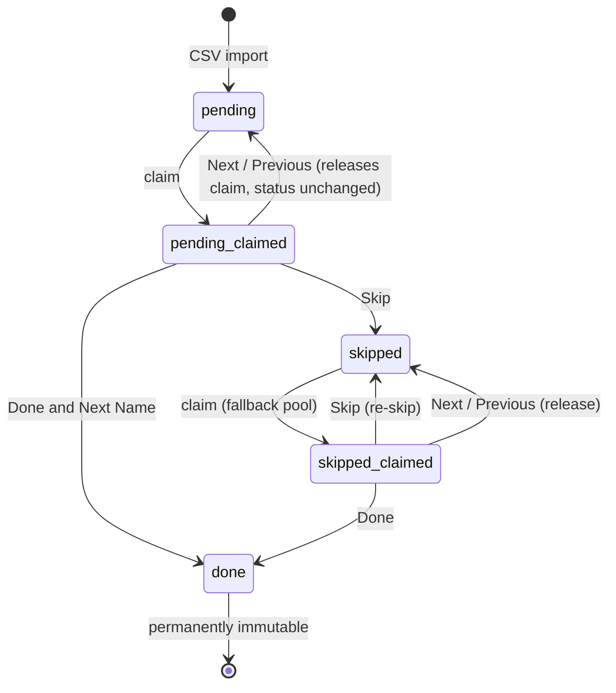

# 11 — Business Logic

This document covers the rules that make Rowdesk behave the way it does, beyond simple CRUD — implemented almost entirely in `src/lib/queue.ts`, `src/lib/csv.ts`, and `src/lib/templates.ts`.

## 1. The Record State Machine

`claimedById` is a separate axis from `status` — a record can be `pending`-and-claimed, `pending`-and-unclaimed, `skipped`-and-claimed, `skipped`-and-unclaimed, or `done` (which is never claimed again by anyone). "Available" for claiming means `status IN (pending, skipped) AND claimedById IS NULL`.

## 2. Claim Algorithm (`claimNextRecordForUser`)

1. **Resume check** — if the caller already holds an available (unresolved) claim other than one they just explicitly left, hand that back rather than claiming something new. This is what makes reloading the Dashboard mid-work non-destructive.
2. **Stale-claim sweep** — release any claim whose `claimedAt` is older than the configured `claimTimeoutMinutes` (default 30), logging a `record_released` audit entry with `reason: "stale_claim_timeout"`.
3. **Candidate selection**, with fresh `pending` records preferred over `skipped` ones:
   - `pending` candidates are ordered by `(sourceFileId, rowIndex)` ascending — i.e. earliest-imported file, earliest row, first.
   - Only once no `pending` candidate remains does the search fall back to `skipped` candidates, ordered by **`updatedAt` ascending** (oldest-skipped-first) — see the rationale below.
4. **Compare-and-swap claim** — `updateMany({ where: { id: candidate.id, claimedById: null }, data: { claimedById, claimedAt } })`. If `count !== 1` (another concurrent request won the race), the candidate is excluded and the search retries, up to 5 attempts.

### Why the skipped-fallback orders by `updatedAt`, not row position

An earlier version ordered the skipped fallback by the same `(sourceFileId, rowIndex)` position as the pending search. Once every row in a file had been skipped at least once, that fixed ordering meant the *lowest-positioned* skipped row was always the top candidate — and because the claim/skip code only ever excludes the single most-recently-skipped id (not a running history), this produced a two-row "ping-pong": skip row 1 → claim row 2 → skip row 2 → claim row 1 (now unexcluded and lowest again) → repeat, forever, never reaching row 3 onward. Ordering by `updatedAt` ascending instead means the row skipped **longest ago** is always the next candidate, which rotates through the entire skipped pool in true FIFO order before any row repeats.

## 3. Previous Navigation (`claimPreviousInFile`)

A deliberate, explicitly-requested exception to "only claim what's unclaimed":

1. Look up the caller's current record (must be their own claim).
2. Find the record at `rowIndex - 1` within the **same** `sourceFileId`.
3. If no such row exists → no-op, `blockedReason: "start_of_file"`.
4. If that row's `status === "done"` → no-op, `blockedReason: "target_done"` (done stays permanently immutable, even to Previous).
5. Otherwise: release the current claim (status unchanged), and claim the target — **overwriting** its `claimedById` even if another user currently holds it. This is the one place in the codebase where the normal exclusivity guarantee is intentionally broken, on the reasoning that stepping back to fix the last record or two is a common, low-risk correction workflow.

## 4. CSV Cleaning Rules

| Rule | Behavior |
|---|---|
| **Column detection** | Case/spacing/underscore-insensitive alias matching (`mapColumns()`) — e.g. `"Business Name"`, `business_name`, `businessname` all map to `name` |
| **Required fields** | `name` and `phone` columns must both be found, or the whole import is rejected before any row is processed |
| **Row rejection** | A row missing a non-empty Name **or** Phone value is dropped entirely and counted (`removedMissingName` / `removedMissingPhone`) — every surviving record is guaranteed callable |
| **Optional fields** | Rating, Maps URL, Website may be blank; blank values are kept as `null` and tracked as data-quality stats, never cause rejection |
| **Rating parsing** | `parseFloat`; unparseable values become `null` rather than rejecting the row |
| **Phone normalization** | See below |

### Phone Normalization

Scraped listings mix formats — e.g. `086809 48502` (landline-style leading trunk `0` + space) versus `8680948502` (bare mobile number) for what is functionally the same kind of number. `normalizePhone()`:

1. Strips every non-digit character (spaces, dashes, parentheses, `+`).
2. If the remaining digit string is 11 digits and starts with `0`, drops the leading `0` (trunk prefix).
3. If it's 12 digits and starts with `91`, drops the leading `91` (India country code).
4. Otherwise leaves it unchanged.

This runs identically for both manual CSV upload and Google Drive import, since both funnel through `rowToRecord()`.

## 5. Outreach Template Composition

Templates are free text containing zero or more `{name}` / `{domain}` tokens. `composeMessage()` / `composeMessageHtml()` (`src/lib/templates.ts`) substitute:

- `{name}` → the record's business name, falling back to `"your business"` if empty.
- `{domain}` → the domain extracted from the record's website URL (`extractDomain()` strips `http(s)://`, `www.`, and any path), falling back to `"your-domain.com"` if empty.

`composeMessageHtml()` additionally HTML-escapes both the template body and the substituted value (so a template author can't inject markup, and a malicious CSV value can't either) and wraps the substituted value in `<mark>` for visual highlighting in the composer.

## 6. Template Dictionary Activation

Exactly one `TemplateDictionary` may have `isActive = true` at any time, enforced by a transaction that deactivates the current one and activates the target atomically. `getActiveTemplateBodies()` reads the active dictionary's `active`-status templates in `position` order; if none exists yet (fresh install, no dictionary created), it falls back to three built-in `STARTER_TEMPLATES` about domain-protection outreach — a vestige of the app's original conceived use case, still available as a seeding option when creating a new dictionary.

## 7. Last-Admin Protection

`countActiveAdmins(excludingId)` blocks disabling or demoting a user if doing so would leave zero `ACTIVE` `ADMIN` users — enforced in `PATCH /api/admin/users/[id]` before the mutation runs, not as a database constraint (there is no CHECK constraint or trigger for this; it's purely application-level).

## 8. Session Revocation on Credential Change

Resetting a user's password (admin action) deletes **all** of that user's `Session` rows, forcing every active session for that account to re-authenticate. A self-service password change does not do this (the user changing it is presumably still the one holding the current session).
