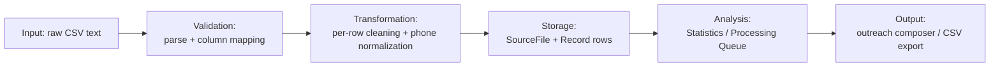

# 12 — Data Processing

## 1. Pipeline Overview

Only the steps actually present in the codebase are documented — there is no deduplication, matching, or aggregation step beyond what's listed below.

## 2. Input Formats

Two entry points, one shared implementation (`importCsvText()` in `src/lib/csvImport.ts`):

| Source | Trigger | Encoding assumption |
|---|---|---|
| Manual upload | Admin selects a `.csv` file in the browser | Whatever `File.text()` decodes it as (UTF-8 in practice) |
| Google Drive | Admin clicks "Process New & Updated" after a scan | Downloaded via `drive.files.get({ alt: "media" }, { responseType: "text" })` |

Expected columns (any subset of aliases recognized): `name`/`businessname`/`company`/`companyname`/`business`; `phone`/`phonenumber`/`contact`/`contactnumber`/`mobile`/`mobilenumber`; `rating`/`avgrating`/`averagerating`/`stars`/`reviewrating`; `mapsurl`/`mapurl`/`googlemapsurl`/`gmap`/`gmaps`/`mapslink`/`maplink`/`googlemaps`/`location`/`locationurl`; `websiteurl`/`website`/`weburl`/`site`/`url`/`web` (all compared case/space/underscore-insensitively).

## 3. Validation

- Parsed with Papa Parse, `header: true`, `skipEmptyLines: true`, headers trimmed.
- If parsing produces zero rows and reports errors, the whole import is rejected with the parser's message.
- `mapColumns()` checks that both `name` and `phone` were found among the headers; if not, the import is rejected listing exactly which required column(s) are missing and what headers *were* found.

## 4. Transformation / Cleaning

Per-row, via `rowToRecord()`:

| Field | Rule |
|---|---|
| `name` | Trimmed; empty → row rejected (`missing_name`) |
| `phone` | Trimmed, then `normalizePhone()`-ed (see [11-business-logic.md](11-business-logic.md)); empty after normalization → row rejected (`missing_phone`) |
| `rating` | `parseFloat`; unparseable → `null`, row kept |
| `mapsUrl` | Trimmed or `null`, row kept either way |
| `websiteUrl` | Trimmed or `null`, row kept either way |

No deduplication is performed against existing records — re-importing the same CSV (or the same Drive file version) will not be attempted twice by the app's own logic (Drive files are only reprocessed when their `modifiedTime` changes), but a manually re-uploaded identical file *would* create a second, fully duplicate `SourceFile` and record set. This is a known limitation — see [24-known-issues.md](24-known-issues.md).

## 5. Storage

One `SourceFile` row per import (never updated after creation except by nothing — it's effectively immutable), and one `Record` row per surviving CSV row, `rowIndex` preserving original CSV order. Both writes happen inside the same request; the `Record.createMany` is a single bulk insert.

## 6. Filtering / Query-Time Processing

The Statistics and Processing Queue pages perform read-time aggregation (via `groupBy`/`count`/`aggregate` Prisma calls) rather than maintaining precomputed rollup tables — see [22-performance-scalability.md](22-performance-scalability.md) for the cost implications at larger data volumes.

## 7. Output Generation

| Output | Mechanism |
|---|---|
| Outreach message (screen) | `composeMessageHtml()` — HTML-escaped, `{name}`/`{domain}` substituted, highlighted |
| Outreach message (clipboard) | `composeMessage()` — plain text, same substitution, no HTML |
| Processed-leads CSV export | `GET /api/admin/export` — hand-built CSV serialization (`csvCell()` quotes/escapes values containing commas, quotes, or newlines) |

## 8. Before / After Example — Phone Normalization

| Before (as scraped) | After (as stored) |
|---|---|
| `086809 48502` | `8680948502` |
| `+91 98765 43210` | `9876543210` |
| `91-98765-43210` | `9876543210` |
| `8680948502` | `8680948502` (unchanged) |

## 9. Before / After Example — Full Row Cleaning

| Field | Before (raw CSV cell) | After (stored `Record`) |
|---|---|---|
| Name | `  ABC Motors  ` | `ABC Motors` |
| Phone | `  +91 98765 43210  ` | `9876543210` |
| Rating | `""` (blank) | `null` |
| Maps URL | `""` (blank) | `null` |
| Website | `https://abcmotors.com` | `https://abcmotors.com` |

## 10. Data Quality Reporting

Every import returns/persists enough information to compute, without a second pass: original row count, rows removed for missing Name, rows removed for missing Phone, and — among **surviving** rows — how many are missing Rating, Maps URL, or Website. These are surfaced in the `CleaningSummary` component immediately after import and rolled up across all files in the Processing Queue and Admin Statistics pages.
