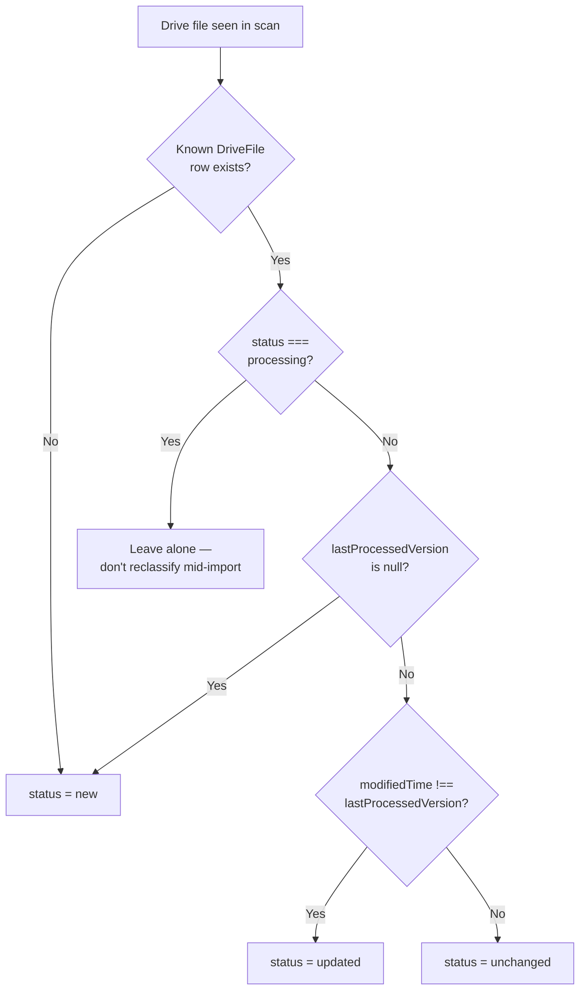

# 16 — External Integrations

## 1. Integration Inventory

| Service | Purpose | Required? |
|---|---|---|
| Google Drive API v3 (OAuth2) | Automated CSV ingestion from a fixed folder | Optional — the app functions fully via manual CSV upload without it |
| Vercel (hosting/build) | Deployment platform | Effectively required for this deployment (not a runtime dependency of the app's code) |
| Neon (managed Postgres) | Production database | Required in production (any Postgres works; Neon is what's provisioned) |

No other third-party API, payment processor, email/SMS provider, or analytics service is integrated anywhere in the codebase.

## 2. Google Drive Integration — Detail

| | |
|---|---|
| **Service** | Google Drive API v3, via the `googleapis` npm SDK |
| **Purpose** | Read-only access to one admin-configured folder (and all subfolders) to automatically discover and import CSV files |
| **Authentication** | OAuth2, Authorization Code flow, `access_type: "offline"` + `prompt: "consent"` (guarantees a refresh token even on repeat connects) |
| **Scopes requested** | `https://www.googleapis.com/auth/drive.readonly`, `https://www.googleapis.com/auth/userinfo.email` |
| **Data exchanged (outbound)** | Standard OAuth token exchange; `files.list` queries (folder ID, MIME type/name filters); `files.get` with `alt: "media"` to download file contents |
| **Data exchanged (inbound)** | Access/refresh tokens; file metadata (id, name, modifiedTime); raw CSV file bytes |
| **Request flow** | See the sequence diagram in [03-system-architecture.md](03-system-architecture.md) §7 |
| **Response flow** | Tokens encrypted and stored in `GoogleDriveConnection`; file metadata stored in `DriveFile`; file contents piped directly into the shared CSV import pipeline (never persisted to disk) |
| **Failure handling** | Per-file: a failed download/import marks that one `DriveFile` as `error` with a message, without blocking the rest of the batch. Connection-level: a missing/invalid refresh token surfaces a specific "reconnect" error message |
| **Rate limits** | Not explicitly handled by the app (no retry/backoff logic) — relies on Drive API's default quotas being sufficient for the folder sizes in practice |
| **Dependencies** | A Google Cloud project with the Drive API enabled, an OAuth consent screen (External, Testing or Published), and a Web-application OAuth Client ID with the exact redirect URI registered |

### Folder Configuration — a deliberate design choice

The scanned folder is fixed via the `GOOGLE_DRIVE_FOLDER_ID` environment variable, **not** editable from the admin UI. `getConfiguredFolderId()` accepts either a bare folder ID or a full Drive URL. Connecting an account immediately auto-verifies and records that folder (`verifyFolder()` confirms it's actually a folder, not some other file type) — there is no separate "choose a folder" step in the UI. To point at a different folder, an operator changes the environment variable and redeploys.

### Recursive Scanning

`listCsvFilesInFolder()` performs a breadth-first traversal of the folder tree starting at the configured root, using a `visited` set to guard against revisiting a folder twice (e.g. if Drive ever returns a folder under two parent links) and a `maxFolders` safety cap (default 500) to bound worst-case API usage.

### File Classification

## 3. Vercel

Build/deploy platform, integrated via Git push or the Vercel CLI (`vercel --prod`). Owns environment-variable storage for production secrets, function hosting, and the production domain (`crm-fx2.vercel.app`). See [18-deployment.md](18-deployment.md) for the full deployment pipeline.

## 4. Neon (PostgreSQL)

Serverless Postgres provisioned via the Vercel Marketplace integration (`vercel integration add neon`), which automatically creates a separate database branch per Vercel environment (production/preview/development) and injects `DATABASE_URL` (plus related `POSTGRES_*`/`PG*` variables) into the project's environment variables. The application itself talks to it only through Prisma Client — no Neon-specific SDK or API is used in application code.

## 5. Integrations Explicitly Not Present

Email/SMS sending, payment processing, analytics/telemetry SDKs, error-tracking SaaS (Sentry etc.), chat/support widgets, CRM or marketing-automation platforms, and any social-login provider are all absent from this codebase.
