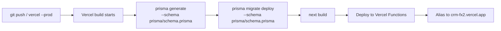

# 18 — Deployment Documentation

## 1. Environments

| Environment | Database | How it's run |
|---|---|---|
| Local development | The same Neon Postgres database production uses, via `DATABASE_URL` in `.env.local` | `npm run dev` (Next.js dev server, Turbopack) |
| Test | None by default — database-backed tests skip themselves. A disposable Postgres database (e.g. a separate Neon branch) when `TEST_DATABASE_URL` is set | `npm test`, or `TEST_DATABASE_URL="<url>" npm test` for the full suite (see [17-testing.md](17-testing.md)) |
| Production | PostgreSQL (Neon, serverless) | Vercel — `crm-fx2` project, deployed from the `master` branch of `github.com/ARULKINT/rowdesk` |

There is no separate staging environment in this deployment — Vercel does implicitly create **preview** deployments for non-production branches/PRs (each with its own Neon branch, per the marketplace integration's behavior), but none is actively used as a persistent staging environment today. There is also no local/SQLite database of any kind — local development intentionally points at the real production database, so schema and data changes made locally are immediately real.

## 2. One Postgres Schema, One Migration History

`prisma/schema.prisma` is the only schema, `prisma/migrations/` the only migration history, used identically by local dev, tests, and production. `prisma.config.ts` loads `.env` then `.env.local` (with override) before every Prisma CLI command, matching Next.js's own env-file precedence — so `next dev`, `prisma migrate dev`, `prisma studio`, etc. all resolve `DATABASE_URL` to the same database without needing a `--schema` flag or manual env overrides.

### Adding a schema change (developer workflow)

```bash
npx prisma migrate dev --name <change>
```

This computes and applies the migration against whatever `DATABASE_URL` currently resolves to — normally the real database, since there's nothing else to point it at. Review the generated `.sql` before running this against data you care about.

## 3. Build & Deploy Pipeline

`vercel.json`:
```json
{
  "buildCommand": "prisma generate --schema prisma/schema.prisma && prisma migrate deploy --schema prisma/schema.prisma && next build"
}
```

Every Vercel build therefore, in order: (1) generates a fresh Prisma Client, (2) runs `migrate deploy` (non-interactive, applies any pending migrations — **not** `migrate dev`) against the production database, (3) builds the Next.js app. This means **schema migrations run automatically as part of every deploy** — there is no separate manual migration step for ordinary changes, as long as the migration was committed (it's often already applied by the time of deploy, since local dev runs against the same database — in that case `migrate deploy` is a documented no-op).



## 4. Database Provisioning

Production Postgres is **Neon**, provisioned through the Vercel Marketplace integration (`vercel integration add neon`). This automatically:
- Creates a Neon project.
- Creates a separate database **branch per Vercel environment** (production, preview, development).
- Injects `DATABASE_URL` (and related `POSTGRES_*`/`PG*`/`NEON_*` variables) into the Vercel project's environment variables for each environment.

## 5. Environment Variables

| Variable | Required | Set where | Purpose |
|---|---|---|---|
| `DATABASE_URL` | Always | `.env.local` locally (via `vercel env pull`) / Vercel project settings in production — same Neon Postgres URL either way | Prisma datasource connection string |
| `ENCRYPTION_KEY` | Only if using Google Drive | `.env` / Vercel | Encrypts stored Drive OAuth tokens (any long random string, e.g. `openssl rand -hex 32`) |
| `GOOGLE_CLIENT_ID` | Only if using Google Drive | `.env` / Vercel | OAuth client ID from Google Cloud Console |
| `GOOGLE_CLIENT_SECRET` | Only if using Google Drive | `.env` / Vercel | OAuth client secret |
| `GOOGLE_REDIRECT_URI` | Only if using Google Drive | `.env` (localhost) / Vercel (production URL) | Must exactly match a redirect URI registered on the OAuth client |
| `GOOGLE_DRIVE_FOLDER_ID` | Only if using Google Drive | `.env` / Vercel | Fixed source folder (bare ID or full Drive URL) — intentionally not admin-editable in the UI |

Never commit `.env`; `.env.example` documents the shape without secrets.

## 6. Deployment Commands Used in Practice

```bash
vercel link                 # one-time: associate the local repo with the Vercel project
vercel integration add neon --plan free_v3   # one-time: provision Postgres
vercel env pull .env.production.local --environment=production   # inspect prod env vars locally when needed
vercel --prod --yes         # deploy the current working tree to production
```

`vercel --prod --yes` was the command used throughout this project's development to ship each change to `https://crm-fx2.vercel.app` — it builds and promotes to production in one step (equivalent to a Git-push-triggered deploy, but invoked directly from the CLI).

## 7. Production Admin Bootstrapping

The first production admin account cannot be created through the UI (there is no self-registration). It was created once via a temporary, non-committed script run directly against the production database using the generated Postgres Prisma Client, with a randomly generated password shared once and never written to the repository. For any future re-bootstrap, the same approach (a throwaway script, or direct SQL via the Neon console) is the only option — see [19-developer-setup.md](19-developer-setup.md) for the equivalent *local* dev-seeding path, which is UI-free but scripted and safe to re-run (`npm run db:seed`).

## 8. Rollback

Vercel retains every previous deployment; rolling back is "promote an earlier deployment to production" via the Vercel dashboard or `vercel rollback`. **Database migrations are not automatically rolled back** — if a deploy included a destructive schema change, rolling back the *code* does not undo the *migration*; this must be handled manually (Prisma does not generate down-migrations by default).

## 9. SSL/TLS, CDN, Domains

Handled entirely by Vercel's platform (automatic TLS certificates, edge caching for static assets, the `*.vercel.app` domain). No custom domain, CDN configuration, or containerization is present in this codebase.

## 10. CI/CD

There is no separate CI pipeline configuration file (no GitHub Actions workflow) in this repository — Vercel's own Git integration (when connected) or direct CLI invocation (`vercel --prod`) is the entire deploy mechanism. Test/lint/typecheck are run manually/locally rather than gating deploys automatically.
