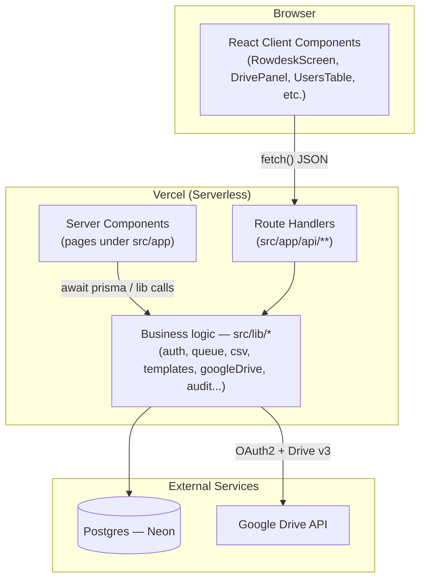
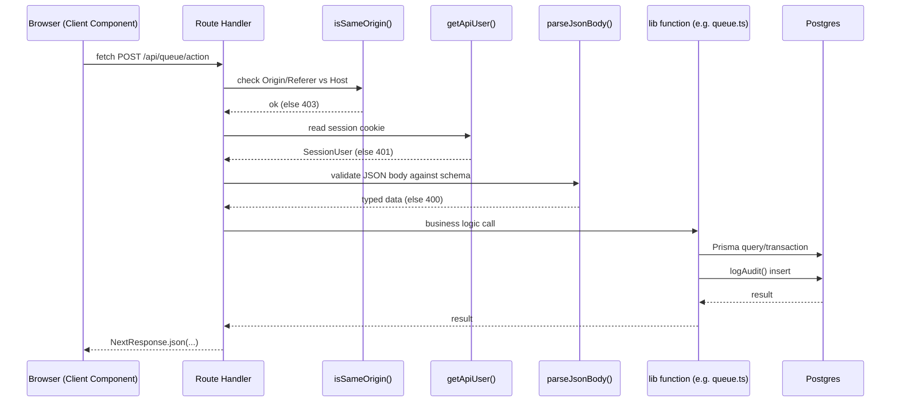
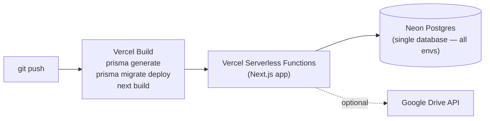
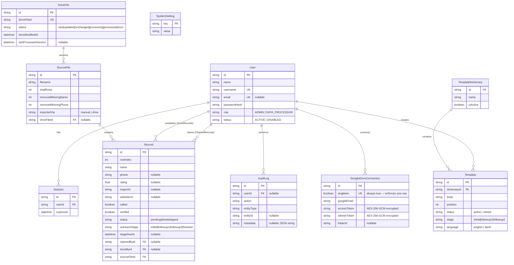
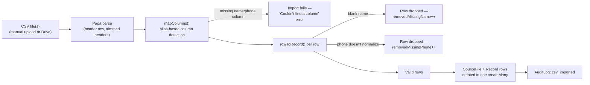
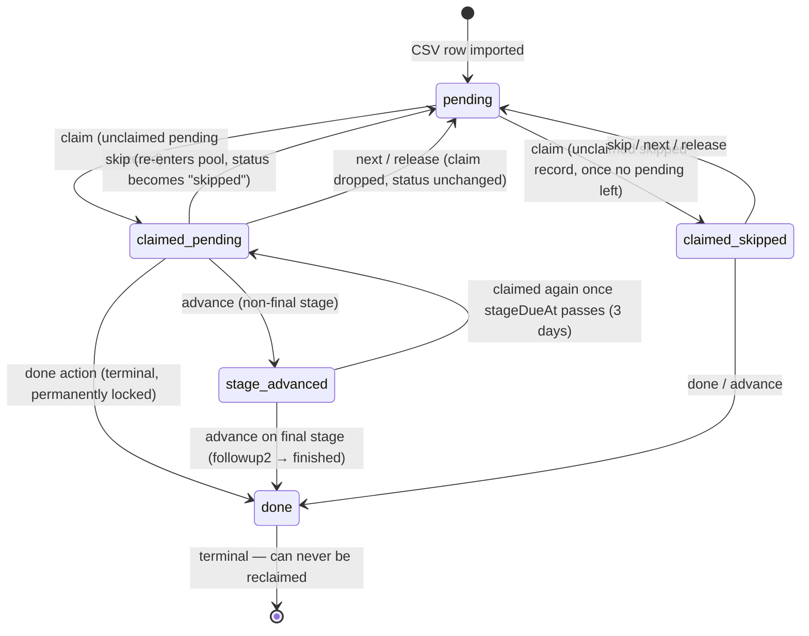

# Rowdesk — Complete Project Documentation

**One file, everything a developer needs.** This document was produced by direct inspection of the source code, `prisma/schema.prisma`, the Git history, and every route/page/lib file in `src/` as of commit `bd3c535` (2026-09-09). It supersedes the multi-file `docs/01-*.md … docs/27-*.md` package in this same folder, which was generated one day earlier (commit `0a84db2`) and is now stale — it predates the bilingual 3-stage outreach sequence, multi-file CSV import, the SQLite removal, the simplified queue action bar, and the outreach-stage statistics breakdown. Nothing below is invented: anything not directly verifiable in code is explicitly marked **Not implemented** or **Recommendation**.

> **Reading this codebase for the first time?** This app runs on **Next.js 16**, which has real breaking changes vs. older Next.js you may know from training data (route params/`searchParams` are `Promise`s that must be `await`ed, `cookies()`/`headers()` are async, layout prop types come from generated helpers like `LayoutProps<"/">`). You'll see all of this in the code excerpts below — treat them as the source of truth over any prior assumption about how Next.js works.

---

## Table of Contents

1. [Project Overview](#1-project-overview)
2. [Technology Stack](#2-technology-stack)
3. [System Architecture](#3-system-architecture)
4. [Project Structure](#4-project-structure)
5. [Database Schema](#5-database-schema)
6. [Authentication & Sessions](#6-authentication--sessions)
7. [Roles & Permissions](#7-roles--permissions)
8. [Core Business Logic](#8-core-business-logic)
9. [API Reference](#9-api-reference)
10. [Pages / UI Reference](#10-pages--ui-reference)
11. [Google Drive Integration](#11-google-drive-integration)
12. [Security](#12-security)
13. [Error Handling](#13-error-handling)
14. [Testing](#14-testing)
15. [Developer Setup](#15-developer-setup)
16. [Deployment](#16-deployment)
17. [Environment Variables Reference](#17-environment-variables-reference)
18. [Known Issues & Technical Debt](#18-known-issues--technical-debt)
19. [Roadmap (Recommendations)](#19-roadmap-recommendations)
20. [FAQ](#20-faq)
21. [Glossary](#21-glossary)

---

## 1. Project Overview

**Rowdesk** is an internal, multi-user web tool for two jobs that happen together:

1. **Cleaning scraped business-listing data** — CSV exports (e.g. from Google Maps scraping) get normalized: bad rows dropped, phone numbers canonicalized, columns auto-detected regardless of naming.
2. **Running a manual outreach sequence against that data** — one record at a time, from a shared queue that locks to whoever is working it, through a 3-stage bilingual (English + Tamil) domain-protection sales sequence, 3 days apart per stage.

**Target users**: a small internal team — a handful of `DATA_PROCESSOR` users doing the outreach work, and one or more `ADMIN` users who import data, manage users/templates, and watch statistics.

**Problem it solves**: raw scraped CSVs are messy (missing names/phones, garbage phone formats, inconsistent columns) and manual outreach across many people needs a way to avoid duplicate contact, track who's done what, and enforce a timed follow-up cadence — without building a full CRM.

**Current status**: actively developed, deployed to production on Vercel at `crm-fx2.vercel.app`, backed by a single shared Postgres (Neon) database used identically by local dev, and production (no separate "dev" database).

**Out of scope / not implemented**: no AI/ML, no automated sending of messages (copy-paste workflow by design — see [§8.3](#83-outreach-sequence--message-templates)), no multi-tenant support (single organization), no self-service signup or password reset, no CI/CD pipeline.

---

## 2. Technology Stack

| Technology | Version | Category | Purpose |
|---|---|---|---|
| Next.js | 16.3.4 | Framework | App Router — Server Components for pages, Route Handlers for the API, both deployed as Vercel serverless functions |
| React | 19.2.8 | UI library | Server + Client Components |
| TypeScript | ^5 | Language | Strict typing across the whole app |
| Prisma | ^6.19.3 (`prisma` + `@prisma/client`) | ORM | Schema, migrations, typed query client |
| PostgreSQL | — (via Neon) | Database | The only database — no SQLite, no local dev database |
| Zod | ^4.5.4 | Validation | Every mutating API route's request body |
| bcryptjs | ^3.0.3 | Crypto | Password hashing (cost factor 12) |
| Node `crypto` (built-in) | — | Crypto | AES-256-GCM encryption of stored Google OAuth tokens |
| googleapis | ^178.0.0 | Integration | Google Drive v3 API + OAuth2 client |
| papaparse | ^5.7.0 | Parsing | CSV parsing on the server |
| Tailwind CSS | ^4 | Styling | Utility classes for layout/spacing (colors come from CSS custom properties, not Tailwind's palette) |
| Vitest | ^5.0.0 | Testing | Unit + integration tests |
| server-only | ^0.0.1 | Build-time guard | Marks modules that must never bundle into client code |
| Vercel | — | Hosting | Build + deploy, `vercel.json` drives the build command |

No state-management library, no CSS-in-JS, no ORM alternative, no separate backend service — everything lives in one Next.js app.

---

## 3. System Architecture

### 3.1 High-Level Architecture



### 3.2 Request Lifecycle (a typical mutating action)



Every mutating Route Handler in this codebase repeats this exact pattern: same-origin check → session check (→ role check if admin-only) → Zod validation → business logic → JSON response. There is no shared middleware (`middleware.ts` does not exist in this project) — each route/page does its own check.

### 3.3 Deployment Architecture



There is exactly **one** Postgres database used by production *and* local development (via `vercel env pull` writing `DATABASE_URL` into `.env.local`). This is a deliberate project decision (see commit `debc390`, "Remove the local SQLite database entirely"), not an oversight — local dev is expected to work against real data.

---

## 4. Project Structure

```text
src/
├── app/                        Next.js App Router — pages + API routes
│   ├── page.tsx                 "/" — redirects to /dashboard or /login
│   ├── login/page.tsx            "/login" — client-side login form
│   ├── layout.tsx                Root layout — fonts, <html>/<body>
│   ├── error.tsx                 Root error boundary
│   ├── dashboard/                "/dashboard" — the outreach queue screen (main app screen)
│   ├── statistics/                "/statistics" — a Data Processor's own stats
│   ├── profile/                   "/profile" — name/username/role + change password
│   ├── admin/                    Admin-only section (guarded by requireAdmin() in layout.tsx)
│   │   ├── layout.tsx             Wraps all /admin/* pages, calls requireAdmin()
│   │   ├── statistics/            Org-wide stats, filterable
│   │   ├── users/                 User management (create/edit/disable/role/reset password)
│   │   ├── drive/                 Google Drive connect/scan/process UI
│   │   ├── queue/                 Processing-queue overview + CSV export link
│   │   ├── import/                Manual CSV upload (multi-file)
│   │   ├── templates/             Template Dictionaries management
│   │   ├── audit/                 Audit log viewer (filter/search/paginate)
│   │   └── settings/              Claim-timeout + timezone settings
│   └── api/                      Route Handlers — see §9 for the full table
├── components/                 Shared React components (see table below)
└── lib/                        Server-only business logic — see table below
```

### 4.1 `src/lib/*.ts` — Business Logic Modules

| File | Responsibility |
|---|---|
| `auth.ts` | Password hashing/verification, session create/destroy/resolve, `requireUser`/`requireAdmin`/`getApiUser` guards |
| `queue.ts` | The claim/skip/done/advance/previous state machine — the heart of the app |
| `csv.ts` | Column-alias detection, phone normalization, row→record mapping, domain extraction (pure functions, fully unit-tested) |
| `csvImport.ts` | Orchestrates parsing + persistence for both manual and Drive-sourced CSV imports |
| `templates.ts` | Message composition (`{domain}`/`{name}` substitution), starter templates, HTML-escaped preview rendering |
| `templateDictionary.ts` | Loads the active dictionary's templates grouped by outreach stage × language |
| `googleDrive.ts` | OAuth2 client, folder scanning (recursive, BFS), file classification, token refresh |
| `encryption.ts` | AES-256-GCM encrypt/decrypt for Drive tokens at rest |
| `audit.ts` | `logAudit()` — writes to `AuditLog`; the closed list of valid `AuditAction` values |
| `rateLimit.ts` | In-memory fixed-window rate limiter (login attempts) |
| `csrf.ts` | Same-origin check for mutating routes |
| `schemas.ts` | All Zod request schemas |
| `validate.ts` | `parseJsonBody()` — parses + validates a request body against a Zod schema |
| `settings.ts` | `SystemSetting` key/value store (claim timeout, timezone) with defaults |
| `stats.ts` | `dailyCounts()` — buckets timestamps into a daily chart series |
| `time.ts` | `nowMs()` — wraps `Date.now()` to satisfy React's purity lint in render |
| `prisma.ts` | The singleton `PrismaClient`, cached on `globalThis` in dev to survive hot-reload |
| `testing/server-only-stub.ts` | Vitest alias target for the `server-only` package (so lib modules can be unit-tested outside Next.js) |

### 4.2 `src/components/*.tsx` — Shared UI Components

| Component | Purpose |
|---|---|
| `RowdeskScreen.tsx` | The entire dashboard queue UI — record display, two message composers, action bar. The single largest component in the app. |
| `AppHeader.tsx` | Top nav bar; renders a different nav list for `ADMIN` vs `DATA_PROCESSOR` |
| `LogoutButton.tsx` | Posts to `/api/auth/logout`, redirects to `/login` |
| `CleaningSummary.tsx` | Renders CSV import cleaning stats (rows removed, missing fields) |
| `ErrorState.tsx` / used by `error.tsx` boundaries | Generic "Something went wrong" retry UI |
| `LoadingState.tsx` | Generic loading placeholder, used by `loading.tsx` files |
| `StatCard.tsx` | A single labeled metric tile, used throughout the statistics/admin pages |
| `SimpleBarChart.tsx` | Minimal daily-bar chart (no charting library dependency) |

---

## 5. Database Schema

Single Postgres database, one Prisma schema (`prisma/schema.prisma`), two migrations to date (`20260907172739_init`, `20260908090000_add_outreach_stages`).

### 5.1 Entity-Relationship Diagram



### 5.2 Table-by-Table Reference

**`User`** — one row per human account. `role` and `status` are plain strings, not Postgres enums (`ADMIN`/`DATA_PROCESSOR`, `ACTIVE`/`DISABLED`) — validated at the application layer via Zod (`schemas.ts`), not a DB constraint. Indexed on `role`.

**`Session`** — one row per active login. `expiresAt` is set 30 days out at creation (`SESSION_TTL_MS` in `auth.ts`); there's no sliding-expiration/refresh — a session is good for a flat 30 days from login. Deleted on logout, on password reset (all of a user's sessions), and lazily on next-access if expired.

**`SourceFile`** — one row per CSV import (manual or Drive). Tracks `totalRows` (before cleaning) and `removedMissingName`/`removedMissingPhone` counts for the cleaning-summary UI. `importedVia` distinguishes manual uploads from Drive-sourced ones; `driveFileId` links back to the `DriveFile` it came from when applicable. **Each successful import always creates a new `SourceFile`** — re-importing an updated Drive CSV does not overwrite or delete the previous version's records, so already-claimed/completed rows from the old version are never touched (see [§18](#18-known-issues--technical-debt) for the flip side of this: duplicate imports aren't detected).

**`GoogleDriveConnection`** — a **singleton** table (`singleton Boolean @unique @default(true)` forces exactly one row). Holds the OAuth tokens (encrypted at rest, see [§12](#12-security)) for one connected Google account, and the resolved `folderId`/`folderName` of the env-configured source folder.

**`DriveFile`** — one row per distinct file discovered in the configured Drive folder (tracked by `driveFileId`, Drive's own file ID). `status` drives the Admin → Google Drive UI: `new`/`updated`/`unchanged` come from comparing `driveModifiedAt` (from Drive) against `lastProcessedVersion` (the modified-time as of the last *successful* import); `processing` is a transient lock state during import; `processed`/`error` are terminal per-attempt outcomes. Indexed on `status`.

**`Record`** — one row per business-listing lead. This is the busiest table in the schema:
- `status`: `pending` (never worked) → `done` (permanently locked, terminal) or `skipped` (returns to the shared pool).
- `outreachStage`: `initial` → `followup1` → `followup2` → `finished` (set only via `advanceStage`, distinct from `status=done` which can also be set directly via the `done` queue action — see [§8.2](#82-the-queue-claimskipdoneadvanceprevious-state-machine)).
- `stageDueAt`: null or in the past = eligible for the queue now; set 3 days in the future when a non-final stage is advanced.
- `claimedById`/`claimedAt`: who currently holds the record and since when — cleared on skip/done/release, and by the stale-claim sweep.
- `doneById`/`doneAt`: set once, when the record reaches a terminal state.
- `called`/`verified`: two independent booleans a Data Processor toggles manually per record (`verified` also auto-opens the Google Maps URL in a new tab when turned on).
- Indexes: `(sourceFileId, rowIndex)` (Previous-button lookups), `(status, claimedById)` (queue candidate search), `(claimedAt)` (stale-claim sweep), `(stageDueAt)` (due-now filtering).

**`TemplateDictionary`** / **`Template`** — a dictionary is a named set of outreach message templates; exactly one dictionary is `isActive` at a time (enforced at the application layer in the activate route via a transaction, not a DB constraint). Each `Template` belongs to one `(stage, language)` slot and has its own `position` for ordering within that slot — reordering one slot never touches another's positions (see `PATCH /api/admin/templates/[id]` with `op: "move"`).

**`AuditLog`** — an append-only event log. `metadata` is a raw JSON string (not a native `Json` column — SQLite-compat leftover, now cosmetic since the DB is Postgres-only). No entity ever seems to be hard-deleted from this table — there is no delete/retention logic anywhere in the code, so it grows unbounded (flagged in [§18](#18-known-issues--technical-debt)).

**`SystemSetting`** — a plain key/value store, currently holding exactly two keys: `claimTimeoutMinutes` (default 30) and `timezone` (default `Asia/Kolkata`, though nothing in the code currently *uses* the timezone value for date math — all date bucketing in `stats.ts` uses the server's local time zone implicitly).

---

## 6. Authentication & Sessions

**Mechanism**: username-or-email + password, no third-party auth provider, no OAuth login for end users (Google OAuth is used *only* for the admin's Drive integration, a completely separate concern — see [§11](#11-google-drive-integration)).

- Passwords hashed with **bcrypt, cost factor 12** (`hashPassword`/`verifyPassword` in `auth.ts`).
- On successful login, a `Session` row is created and its `id` is set as an **httpOnly, `SameSite=Lax`, `Secure` (in production)** cookie named `rowdesk_session`, expiring in 30 days.
- `resolveSessionUser(token)` is the pure, testable core: looks up the session, checks expiry (deletes it if expired), checks the user's `status === "ACTIVE"` (a disabled user's existing session is silently treated as invalid — logging in again is also blocked, in `login/route.ts`).
- `getSessionUser()` wraps that with the actual cookie read (`next/headers` — async in Next.js 16: `await cookies()`).
- Three guard functions layer on top:
  - `requireUser()` — for Server Components; **redirects to `/login`** if unauthenticated.
  - `requireAdmin()` — for Server Components; requires `requireUser()` **and** `role === "ADMIN"`, else redirects to `/dashboard`.
  - `getApiUser()` — for Route Handlers; returns `null` instead of redirecting (the caller returns its own 401/403 JSON response).

**Logout**: deletes the `Session` row and the cookie (`destroySession()`), audit-logged.

**Password reset**: **admin-only**, no self-service flow. An admin sets a new password from Admin → Users, which also deletes *all* of that user's existing sessions (forces re-login everywhere). A user can change their own password from `/profile` (`ChangePasswordForm.tsx` → `POST /api/profile/password`), which requires the current password.

**Login rate limiting**: two independent in-memory buckets per attempt (`rateLimit.ts`) — 20 attempts / 15 min per client IP, and 8 attempts / 15 min per submitted identifier (username/email), both checked in `POST /api/auth/login` before the password is even checked.

---

## 7. Roles & Permissions

Two roles, no finer-grained permission system:

| Capability | `DATA_PROCESSOR` | `ADMIN` |
|---|:---:|:---:|
| `/dashboard` — work the queue | ✅ | ✅ (same screen) |
| `/statistics` — own stats | ✅ | — (admin has `/admin/statistics` instead) |
| `/profile` — change own password | ✅ | ✅ |
| `/admin/*` — entire admin section | ❌ (redirected to `/dashboard`) | ✅ |
| Import CSV (`POST /api/import`) | ❌ (403) | ✅ |
| Manage users, templates, settings, Drive | ❌ | ✅ |
| View audit log, export processed CSV | ❌ | ✅ |

**Enforcement points** (defense at every layer, not just the UI):
- Server Components: `requireUser()` / `requireAdmin()` (redirect-based).
- `admin/layout.tsx` wraps *every* admin page — a `DATA_PROCESSOR` cannot reach any `/admin/*` route even if they know the URL.
- Route Handlers: every admin-only route independently re-checks `user.role !== "ADMIN"` and returns `403 Forbidden` — there's no shared middleware doing this, so **a new admin API route must remember to add this check itself** (see [§18](#18-known-issues--technical-debt)).

**Last-admin protection**: `PATCH /api/admin/users/[id]` refuses to disable the last active admin or demote the last active admin's role away from `ADMIN` (`countActiveAdmins`), preventing total lockout.

**Bootstrapping the first admin**: there is no seed script or setup wizard in this repo. The first `ADMIN` user must be inserted directly (e.g. via `prisma studio` or a one-off script) — every subsequent admin can then be created from Admin → Users normally.

---

## 8. Core Business Logic

### 8.1 CSV Import & Cleaning Pipeline



**Column detection** (`mapColumns` in `csv.ts`) normalizes each header (`trim().toLowerCase().replace(/[^a-z0-9]/g, "")`) and matches against an alias list per field, so `"Business Name"`, `business_name`, and `BusinessName` all map to `name`. Required fields: `name`, `phone`. Optional: `rating`, `mapsUrl`, `websiteUrl` — blank values there are *kept* and counted as data-quality stats, not removed.

**Phone normalization** (`normalizePhone`) — the most detail-sensitive piece of logic in the app:
1. Strip all non-digit characters.
2. 12 digits starting `91` → drop the country code (→ 10 digits).
3. 11 digits starting `0` → drop the trunk prefix (→ 10 digits) — but **only** when this leaves exactly 10 digits; an already-10-digit number starting `0` is **rejected outright** rather than guessed at, because the real last digit was already lost upstream (before the CSV even reached the app) and stripping the `0` would just produce a 9-digit number.
4. The result must match `^[6-9]\d{9}$` (a valid Indian mobile prefix) or the row is rejected — this deliberately excludes landline/STD-code numbers (useless for SMS/WhatsApp outreach) and garbage-length scrape noise. This rejection logic (commit `7d6f0c7`) is a direct **replacement** for previously importing unusable numbers.

**Multi-file import** (`POST /api/import`, commit `6d14de5`): the admin can select multiple `.csv` files in one form submission; they're processed **sequentially** (not in parallel — each does its own bulk insert against the same connection pool, and sequential processing keeps partial-failure ordering easy to reason about), each producing its own `ImportFileResult` with its own success/failure and its own `CleaningSummary`.

**Shared pipeline**: `importCsvText()` in `csvImport.ts` is called identically by manual upload (`/api/import`) and Google Drive processing (`/api/admin/drive/process`) — there is exactly one cleaning/persistence code path, so the two entry points can never drift apart.

### 8.2 The Queue: Claim/Skip/Done/Advance/Previous State Machine



**Claiming** (`claimNextRecordForUser`): if the caller already holds an available record, that's returned as-is (idempotent — visiting `/dashboard` twice doesn't re-shuffle your assignment). Otherwise:
1. `releaseStaleClaims()` first sweeps any record claimed longer ago than `claimTimeoutMinutes` (Admin → Settings, default 30) back to unclaimed, audit-logging each as `record_released` with `reason: "stale_claim_timeout"`.
2. `findCandidate()` picks the best unclaimed, "due now" (`stageDueAt` null or past) record: **fresh `pending` rows first** (ordered by `sourceFileId, rowIndex`), falling back to `skipped` rows **only once no pending ones remain** (ordered oldest-`updatedAt`-first, to rotate fairly through the whole skipped pool rather than bouncing between the same one or two rows forever).
3. Claimed via a **compare-and-swap `updateMany`** (`where: { id, claimedById: null }`) with up to 5 retries against different candidates — this avoids a raw `SELECT ... FOR UPDATE`, so the exact same code path works whether the connection is Postgres or (historically) SQLite. Two users hitting `/dashboard` simultaneously can never be handed the same record (covered by a dedicated concurrency test in `queue.test.ts`).

**Skip**: releases the claim, sets `status: "skipped"` (a genuinely visible, audited status — it isn't silently folded back into `pending`).

**Done** (`completeRecord`): **permanently terminal** — `status: "done"`, `doneById`, `doneAt` set. A done record can never be claimed, skipped, or advanced again (enforced by `assertOwnership` + `claimPreviousInFile`'s explicit `target.status === "done"` block).

**Advance** (`advanceStage`) — the outreach-sequence engine: if the record isn't on the final stage (`followup2`), it moves to the next stage, sets `stageDueAt` to **3 days from now**, and releases the claim (record returns to the shared pool but is invisible to `findCandidate()` until `stageDueAt` passes). Advancing *from* `followup2` instead completes the record exactly like `done` (`outreachStage: "finished"`), audited as `record_completed` with `metadata: { via: "stage_advance" }`.

**Previous** (`claimPreviousInFile`) — a deliberate, audited exception to "only claim what's available": steps back to `rowIndex - 1` **within the same source file**, releasing the caller's current claim (status unchanged) and claiming the target — **stealing** it from whoever currently holds it, if anyone. Two guardrails: refuses to step into a `done` row (`blockedReason: "target_done"`), and refuses at row 0 (`blockedReason: "start_of_file"`). This exists to let an agent quickly correct the last record or two without losing their place.

### 8.3 Outreach Sequence & Message Templates

Introduced in commits `00c9709`→`fc50a18`→`bd3c535`. Every record moves through up to three outreach touches, 3 days apart:

| Stage | Trigger | On "Done and Next Name" | Statistics label |
|---|---|---|---|
| `initial` | CSV import | Schedules `followup1`, 3-day wait | "Initial" |
| `followup1` | 3 days after initial | Schedules `followup2`, 3-day wait | "Follow-up 1" |
| `followup2` | 3 days after followup1 | **Completes the record** (`status: done`, `outreachStage: finished`) | "Follow-up 2" |

**Each stage shows two message boxes** on the dashboard — "Message 1" (English) and "Message 2" (Tamil, fixed per commit `fc50a18` — there is **no language toggle**; both languages are always shown side by side). Both are populated from the **active** `TemplateDictionary`'s templates for that exact `(stage, language)` slot, cycled with ◁/▷ if more than one exists for that slot. `{domain}` and `{name}` placeholders are substituted from the current record (`extractDomain(websiteUrl)`, falling back to `"your-domain.com"`/`"your business"` when absent).

**Two-message Done gating**: the "Done and Next Name" button is disabled until **both** message boxes have been copied at least once for the current record+stage (`box1Ready && box2Ready` in `RowdeskScreen.tsx`) — this prevents marking a stage done without actually having copied the outreach text to send. A box with zero templates configured for its slot is treated as automatically "ready" so a gap in the template library can't jam the whole queue. Both boxes reset (fresh copy state, template index 0) whenever the record *or* the stage changes.

**Templates are admin-managed** (`/admin/templates`) as one or more named "dictionaries"; **exactly one dictionary is active at a time**, and only that dictionary's `status: "active"` templates populate the composer. Templates that have been used historically aren't deleted, only **retired** (`status: "retired"`) — retired templates are hidden from the composer but preserved for audit/reference, and can be restored. Reordering (`↑`/`↓`) is scoped per `(stage, language)` slot via a position swap inside a transaction.

If a brand-new dictionary has zero `initial`/`english` templates (nothing configured yet), the app falls back to three hardcoded `STARTER_TEMPLATES` (`templates.ts`) — this fallback applies **only** to that one slot, preserving pre-outreach-sequence behavior; every other slot with no templates shows an explicit "No {stage} template in {language} yet" placeholder instead of silently failing.

### 8.4 Statistics Computation

Both `/statistics` (own) and `/admin/statistics` (org-wide, filterable by date range/user/source file) are Server Components that run several parallel Prisma aggregate queries per render (`Promise.all`) — there is no caching layer or pre-computed rollup table; every page load re-derives everything live. `dailyCounts()` (`stats.ts`) buckets a list of `Date`s into a fixed N-day trailing series (14 days for personal stats, 1/7/30/custom for admin) using calendar-day string keys (`toISOString().slice(0, 10)`), so bucketing is effectively UTC regardless of the `timezone` setting (see [§18](#18-known-issues--technical-debt)).

The Admin Statistics **outreach stage breakdown** table (added in `bd3c535`, the most recent commit) reports three counts per stage: records **pending now** (due, unclaimed or claimed but not yet due-gated), **in process** (`stageDueAt` in the future — mid 3-day wait), and **completed past** (records that have moved on to a later stage or `finished`).

---

## 9. API Reference

All Route Handlers live under `src/app/api/`. Every mutating (`POST`/`PATCH`) route performs the same-origin check first; every route (except `GET /api/health`) requires a valid session; admin-only routes additionally require `role === "ADMIN"`.

| Method | Endpoint | Auth | Purpose |
|---|---|---|---|
| `POST` | `/api/auth/login` | Public (rate-limited) | Authenticate, create session cookie |
| `POST` | `/api/auth/logout` | Session | Destroy session, clear cookie |
| `POST` | `/api/queue/claim` | Session | Claim the next available record |
| `POST` | `/api/queue/action` | Session | `skip` \| `done` \| `next` \| `previous` \| `advance` on a claimed record |
| `PATCH` | `/api/records/[id]` | Session (must own claim) | Toggle `called`/`verified` on the caller's claimed record |
| `POST` | `/api/import` | Admin | Upload one or more CSV files |
| `GET` | `/api/admin/export` | Admin | Download all `done` records as CSV (optionally filtered by `userId`/`fileId`/date range) |
| `GET` | `/api/admin/users` | Admin | List users with completion stats |
| `POST` | `/api/admin/users` | Admin | Create a user |
| `PATCH` | `/api/admin/users/[id]` | Admin | `disable` \| `enable` \| `role` \| `reset_password` \| `edit` |
| `POST` | `/api/admin/settings` | Admin | Update `claimTimeoutMinutes` / `timezone` |
| `POST` | `/api/admin/templates` | Admin | Create a template in a `(stage, language)` slot |
| `PATCH` | `/api/admin/templates/[id]` | Admin | `edit` \| `retire` \| `restore` \| `move` (up/down within its slot) |
| `POST` | `/api/admin/dictionaries` | Admin | Create a template dictionary (optionally seeded with starters) |
| `POST` | `/api/admin/dictionaries/[id]/activate` | Admin | Make this dictionary the sole active one |
| `GET` | `/api/admin/drive/connect` | Admin | Redirects to Google's OAuth consent screen |
| `GET` | `/api/admin/drive/callback` | Admin | OAuth callback — exchanges code, stores encrypted tokens |
| `POST` | `/api/admin/drive/disconnect` | Admin | Deletes the Drive connection |
| `POST` | `/api/admin/drive/scan` | Admin | Lists CSVs in the configured folder (+ subfolders), classifies new/updated/unchanged |
| `POST` | `/api/admin/drive/process` | Admin | Imports every `new`/`updated` scanned file |
| `POST` | `/api/profile/password` | Session | Change the caller's own password |
| `GET` | `/api/health` | Public | Liveness probe — `SELECT 1` against Postgres |

### 9.1 Endpoint Detail: `POST /api/queue/action`

**Request**: `{ recordId: string, action: "skip" | "done" | "next" | "previous" | "advance" }`

**Response** (200): `{ record: QueueRecordDTO | null }` — the caller's *next* claimed record after the action (except `previous`, which returns `{ record, moved: boolean, blockedReason?: "start_of_file" | "target_done" }`).

**Errors**: `400` (invalid body), `401` (not signed in), `403` (cross-origin), `409` (`OwnershipError` — "This record is no longer assigned to you", e.g. it was stolen via `previous` or timed out).

### 9.2 Endpoint Detail: `POST /api/import`

**Request**: `multipart/form-data` with one or more `file` fields (each must end in `.csv`).

**Response** (200): `{ processed: number, failed: number, results: { filename, ok, error?, summary? }[] }` — always 200 even if every file failed; check `failed`/`results[].ok` for actual outcomes.

### 9.3 Endpoint Detail: `GET /api/admin/export`

Query params (all optional): `userId`, `fileId`, `from`, `to` (ISO dates, filtering `doneAt`). Returns `text/csv` with columns `Name, Google Maps URL, Phone, Average Rating, Website, User ID, Processed Timestamp, Source File, Source File ID, Source Row ID` — only `status: "done"` records.

---

## 10. Pages / UI Reference

| Route | Access | Purpose |
|---|---|---|
| `/` | Public | Redirects to `/dashboard` or `/login` based on session |
| `/login` | Public | Username/email + password form |
| `/dashboard` | Any user | The queue screen — claims a record server-side on load, renders `RowdeskScreen` |
| `/statistics` | Any user | Personal completion stats + 14-day bar chart |
| `/profile` | Any user | Account info (read-only) + change-password form |
| `/admin/statistics` | Admin | Org-wide stats: totals, outreach-stage breakdown table, per-user performance table, data-quality counts; filterable by range/user/source file |
| `/admin/users` | Admin | Create users; per-row role change, enable/disable, password reset, link to that user's audit activity |
| `/admin/drive` | Admin | Connection status, folder info, Scan/Process actions, per-file status table |
| `/admin/queue` | Admin | Pending/claimed/completed/skipped counts, cleaning summary, per-source-file table, currently-claimed table, recently-completed table, CSV export link |
| `/admin/import` | Admin | Multi-file CSV upload with per-file cleaning summaries |
| `/admin/templates` | Admin | Manage template dictionaries; per-dictionary grid of `(stage × language)` sections, each independently addable/editable/reorderable/retirable |
| `/admin/audit` | Admin | Paginated (50/page), filterable (user/action/free-text) audit log |
| `/admin/settings` | Admin | Claim-timeout minutes, timezone |

**Design system**: colors are CSS custom properties defined in `src/app/globals.css` (`--bg`, `--surface`, `--ink`, `--accent`, `--success`, etc.) — **not** Tailwind's default palette; Tailwind utility classes are used only for layout/spacing/typography sizing. Fonts: Libre Franklin (display headings), IBM Plex Sans (body), IBM Plex Mono (data/counters) — all loaded via `next/font/google` in `layout.tsx`.

**Client vs. Server Components**: every `admin/*/page.tsx` is a Server Component that fetches data directly via Prisma and passes it as props to a co-located `"use client"` panel component (e.g. `DrivePanel.tsx`, `UsersTable.tsx`, `DictionariesPanel.tsx`, `SettingsForm.tsx`) that owns the interactive state and calls `router.refresh()` after a mutation to re-fetch server data rather than managing client-side cache invalidation.

---

## 11. Google Drive Integration

**Purpose**: an alternative to manual CSV upload — an admin points the app at one fixed Drive folder, and CSVs dropped there (by anyone with edit access to that folder) get scanned and imported without a human touching the Import page.

**Scope**: `drive.readonly` + `userinfo.email` only — the app can never write to or modify anything in Drive.

**Setup is entirely environment-driven** (`.env.example` documents the exact Google Cloud Console steps): `GOOGLE_CLIENT_ID`, `GOOGLE_CLIENT_SECRET`, `GOOGLE_REDIRECT_URI` (OAuth client), plus `GOOGLE_DRIVE_FOLDER_ID` (accepts a bare ID or a full Drive URL — parsed by `extractFolderId()`). **The folder is fixed at the environment level, not editable from the admin UI** — a deliberate design choice, not a missing feature.

**OAuth flow**: `GET /api/admin/drive/connect` generates a CSRF `state` token (stored in a short-lived httpOnly cookie), redirects to Google; `GET /api/admin/drive/callback` validates `state`, exchanges the `code` for tokens via `connectWithCode()`, which **requires** `access_type: "offline"` + `prompt: "consent"` so a refresh token is always returned (even on a repeat connect) — without one, the connection is rejected with a clear "revoke access and reconnect" message. Tokens are AES-256-GCM encrypted before being written to `GoogleDriveConnection` (see [§12](#12-security)). The configured folder is verified and its name resolved immediately upon connecting.

**Scan** (`POST /api/admin/drive/scan`): recursively lists every CSV in the configured folder and all its subfolders (breadth-first, capped at 500 folders, revisit-guarded), then classifies each against what's already known (`classifyDriveFile`): brand-new → `new`; `modifiedTime` moved past the last successfully-processed version → `updated`; unchanged → `unchanged`; a file currently `processing` is left untouched so a scan can't race an in-flight import.

**Process** (`POST /api/admin/drive/process`): downloads and imports every `new`/`updated` file through the exact same `importCsvText()` pipeline as manual upload, sequentially, updating each `DriveFile`'s status to `processed` (recording `lastProcessedVersion = driveModifiedAt`) or `error` (recording `errorMessage`) as it goes.

**Token refresh**: `getAuthorizedDriveClient()` attaches a `tokens` event listener to the OAuth2 client that transparently re-encrypts and persists a refreshed access token whenever Google issues one mid-request — no separate refresh cron job needed.

---

## 12. Security

### 12.1 Implemented

| Control | Detail |
|---|---|
| Password storage | bcrypt, cost 12 — never stored or logged in plaintext (verified by a dedicated test) |
| Session cookie | httpOnly, `SameSite=Lax`, `Secure` in production, DB-backed (revocable) |
| CSRF | `SameSite=Lax` (blocks cross-site POST from most browsers) **+** an explicit `Origin`/`Referer`-vs-`Host` check (`isSameOrigin()`) on every mutating route as defense-in-depth |
| Input validation | Every mutating route validates its body against a Zod schema before touching the database |
| XSS | User/CSV-supplied values (`{domain}`, `{name}`) and admin-authored template bodies are all HTML-escaped (`escapeHtml()`) before being injected via `dangerouslySetInnerHTML` in the message preview — covered by dedicated tests for both directions (malicious template body, malicious CSV-derived value) |
| SQL injection | Not applicable — 100% Prisma parameterized queries, no raw SQL string concatenation anywhere in the app |
| Secrets at rest | Google OAuth access/refresh tokens are AES-256-GCM encrypted (`encryption.ts`) before being written to Postgres; the encryption key is derived from `ENCRYPTION_KEY` via `scryptSync`, so any sufficiently random string works as the env var |
| Brute-force login | Dual in-memory rate limits (per-IP and per-identifier) on `/api/auth/login` |
| Authorization | Checked independently at the Server Component layer (redirect) **and** the Route Handler layer (403 JSON) for every admin capability — not just hidden in the UI |
| Last-admin lockout prevention | Can't disable or demote the last active admin |

### 12.2 Recommended Improvements (not implemented)

| Gap | Why it matters |
|---|---|
| In-memory rate limiting (`rateLimit.ts`) | Explicitly documented in-code as not scaling across multiple serverless instances — counts reset per cold-start and don't share across concurrent instances. Recommend a shared store (e.g. Upstash Redis) before scaling beyond one instance. |
| No MFA | Single factor (password) protects both processor and admin accounts. |
| No self-service password reset | By design today, but means a locked-out sole admin has no recovery path except direct DB access. |
| `AuditLog.metadata` as a raw string | Stored as an unstructured JSON *string*, not a native Postgres `jsonb` column — harder to query/index; a Postgres-only schema could use `Json` now that SQLite compatibility is no longer a constraint. |
| No CSP / security headers | `next.config.ts` sets no `headers()` — no Content-Security-Policy, `X-Frame-Options`, etc. configured. |
| No dependency scanning / CI | No CI workflow exists in the repo (confirmed absent) — dependency vulnerabilities and regressions are only caught manually. |

---

## 13. Error Handling

**Route Handlers** return a consistent `{ error: string }` JSON body with an appropriate status code (`400` validation, `401` unauthenticated, `403` unauthorized/CSRF, `404` not found, `409` ownership conflict, `429` rate-limited, `500` unexpected/Google API failure). Zod's first validation issue message is surfaced directly to the client (`parseJsonBody`), so error messages are specific ("Password must be at least 8 characters.") rather than generic.

**Server Components / pages**: Next.js `error.tsx` boundaries at the root (`src/app/error.tsx`) and per-section (`dashboard/error.tsx`, `admin/error.tsx`) catch render-time exceptions and show a generic `ErrorState` with a "Try again" button (calling Next's `reset()`); the underlying error is logged to the console client-side (`console.error(error)` in a `useEffect`) but there is **no external error-tracking/APM service wired in** (no Sentry, no Vercel Analytics error reporting) — errors are only visible in Vercel's function logs or the browser console.

**Client-side fetches**: every `"use client"` component that calls the API wraps the `fetch` in try/catch and shows either an inline error message (forms) or a transient toast (`RowdeskScreen`'s `showToast`, auto-dismissing after ~2.6s).

**Audit trail as an error record**: failed logins are themselves audit-logged (`login_failed`, including the attempted identifier) — this is the closest thing to a security-event log in the app.

| Error class | Cause | System behavior | User experience |
|---|---|---|---|
| Invalid/expired session | Cookie missing, session row deleted/expired, or user disabled | `401` from API routes; redirect to `/login` from pages | Bounced to login |
| CSRF / cross-origin | `Origin` header present but doesn't match `Host` | `403`, action never executes | "Invalid request origin." |
| Ownership conflict | Acting on a record no longer claimed by the caller (stolen via Previous, or timed out) | `409`, `OwnershipError` thrown and caught in the route | "This record is no longer assigned to you." |
| Bad CSV | Missing required column, or every row invalid | `400`/`200 {ok:false}` with a specific message naming the missing column(s) or reason | Shown inline on the Import page per-file |
| Rate limited | Too many login attempts | `429` | "Too many login attempts..." with a retry-later message |
| Google Drive not connected/configured | Missing env vars or no stored connection | `400`/redirect with an `?error=` query param | Explained inline on `/admin/drive` |

---

## 14. Testing

```bash
npm test          # vitest run
npx tsc --noEmit
npm run lint
npm run build
```

**Test files and what they cover** (`src/lib/*.test.ts`, run via Vitest, `fileParallelism: false` since DB-backed tests share one database):

| File | Coverage |
|---|---|
| `csv.test.ts` | Column alias detection, phone normalization (every branch: country code, trunk zero, landline rejection, garbage-length rejection), row-to-record cleaning rules, domain extraction |
| `templates.test.ts` | `{domain}`/`{name}` substitution (including multi-occurrence and fallback values), HTML-escaping in both directions (template body, substituted value), starter template shape |
| `rateLimit.test.ts` | Allow-under-limit, block-over-limit, independent per-key buckets |
| `encryption.test.ts` | Round-trip, random-IV uniqueness per call, wrong-key failure, missing-`ENCRYPTION_KEY` error |
| `googleDrive.test.ts` | Recursive folder listing (including subfolder recursion and revisit-guarding), folder-ID parsing (bare ID / full URL / `?id=` param), Drive-file classification (new/updated/unchanged/mid-processing), env-var configuration detection |
| `auth.test.ts` **(DB-backed)** | Password hash round-trip and never-plaintext check, session resolution (valid/expired/unknown/disabled-user) |
| `queue.test.ts` **(DB-backed)** | Concurrency-safe claiming (no double-assignment), claim resumption, empty-queue handling, skip re-queuing, pending-before-skipped priority, fair rotation through the skipped pool, done permanence, full stage-advance sequence (initial→followup1→followup2→finished) including the 3-day due-date gate, ownership rejection on every mutating action, Previous (including claim-stealing and the done/start-of-file blocks), stale-claim timeout release |

**Database-backed tests never touch production**: `auth.test.ts` and `queue.test.ts` freely call `deleteMany()` to reset state between cases, so `vitest.setup.ts` refuses to run them unless `TEST_DATABASE_URL` is explicitly set (pointing at a disposable Postgres database, e.g. a separate Neon branch) — otherwise those two files self-skip with a console warning and every other test still runs:

```bash
TEST_DATABASE_URL="<disposable-postgres-url>" npm test
```

> **Note on a stale in-code comment**: `vitest.config.ts` still says *"Test files share one SQLite file"* — that's leftover from before commit `debc390` removed SQLite entirely. The actual current mechanism (per `vitest.setup.ts`) is `TEST_DATABASE_URL` pointing at Postgres; the comment is cosmetically wrong but harmless (see [§18](#18-known-issues--technical-debt)).

**Not implemented**: no end-to-end/browser tests (Playwright/Cypress), no API integration tests against the running Next.js server (only direct lib-function tests), no visual regression testing, no load/performance testing.

---

## 15. Developer Setup

Prerequisites: Node.js (version matching `@types/node ^24`, i.e. Node 24.x recommended), npm, a Vercel account with access to this project (for `vercel env pull`) or your own Postgres instance.

```bash
git clone <repo-url>
cd crm-fx2
npm install

# Pulls the real DATABASE_URL (and any other configured secrets) from Vercel
vercel env pull .env.local

# Optional — only needed if you'll test Google Drive locally
cp .env.example .env
# then fill in ENCRYPTION_KEY / GOOGLE_CLIENT_ID / GOOGLE_CLIENT_SECRET / GOOGLE_DRIVE_FOLDER_ID

npx prisma generate
npm run dev
```

Open `http://localhost:3000` — you land on `/login`. **There is no seed script and no separate dev database** — you are talking to the same Postgres database as production, so sign in with a real account. To create your very first admin, insert one directly (e.g. via `npx prisma studio`, hashing a password with bcrypt cost 12 first) — every subsequent user can then be created normally from Admin → Users.

**Schema-change gotcha**: if you edit `prisma/schema.prisma` while `npm run dev` is already running, run `npx prisma migrate dev --name <change>` and then **restart** the dev server — Node does not hot-reload the generated Prisma Client package on disk, so a long-running server keeps using the old client and throws `Cannot read properties of undefined` on any new model/field until restarted.

**Commands reference**:

| Command | Effect |
|---|---|
| `npm run dev` | Start the Next.js dev server |
| `npm run build` | Production build (also what Vercel runs) |
| `npm run start` | Serve a production build locally |
| `npm run lint` | ESLint (flat config, `eslint-config-next`) |
| `npm test` | Vitest run (see [§14](#14-testing)) |
| `npx prisma studio` | Visual DB browser/editor against whatever `DATABASE_URL` resolves to |
| `npx prisma migrate dev --name <x>` | Create + apply a new migration against the current `DATABASE_URL` |

---

## 16. Deployment

**Platform**: Vercel. `vercel.json` defines the entire build pipeline:

```json
{ "buildCommand": "prisma generate --schema prisma/schema.prisma && prisma migrate deploy --schema prisma/schema.prisma && next build" }
```

So every deploy: (1) regenerates the Prisma Client, (2) applies any pending migrations against the production `DATABASE_URL` (`migrate deploy`, non-interactive — safe for CI/build environments, unlike `migrate dev`), (3) builds the Next.js app. **A schema change only reaches production if its migration file under `prisma/migrations/` is committed** — there's no separate manual migration step.

**Setting this up from scratch elsewhere**:
1. Push to a Git provider, import into Vercel.
2. Provision Postgres (e.g. `vercel integration add neon`) — this sets `DATABASE_URL` across Vercel's environments automatically.
3. Generate and commit the initial migration against a real reachable Postgres URL.
4. Set `ENCRYPTION_KEY`/`GOOGLE_*` in Vercel project settings if using Drive integration; update `GOOGLE_REDIRECT_URI` to the production callback URL (and register it in Google Cloud Console) if so.
5. Deploy — migrations run automatically from here on.

**No CI/CD pipeline exists** in this repository (confirmed absent — no `.github/workflows/`) — Vercel's own build-and-deploy-on-push is the entire pipeline; there is no automated test/lint gate before a deploy goes live.

**Monitoring**: `GET /api/health` is the only operational endpoint — checks `SELECT 1` against Postgres, returns `{status:"ok"}` (200) or `{status:"error"}` (503). No APM/error-tracking/structured logging is wired in; Vercel's built-in function logs are the only runtime visibility.

**Backups**: not implemented at the application level — relies entirely on the Postgres host's own backup/point-in-time-recovery features (Neon offers this). The specific retention window is a Neon dashboard setting, not part of this codebase.

---

## 17. Environment Variables Reference

| Variable | Required | Sensitive | Purpose |
|---|:---:|:---:|---|
| `DATABASE_URL` | Yes | Yes | Postgres connection string. `.env.local` (from `vercel env pull`) takes precedence over `.env`. |
| `ENCRYPTION_KEY` | Only for Google Drive | Yes | Any long random string (e.g. `openssl rand -hex 32`); derives the AES-256-GCM key for encrypting stored Drive OAuth tokens. **Rotating this invalidates any existing Drive connection** — reconnect from Admin → Google Drive after changing it. |
| `GOOGLE_CLIENT_ID` | Only for Google Drive | Yes | OAuth client ID from Google Cloud Console |
| `GOOGLE_CLIENT_SECRET` | Only for Google Drive | Yes | OAuth client secret |
| `GOOGLE_REDIRECT_URI` | Only for Google Drive | No | Must exactly match (protocol/host/path) the redirect URI registered in Google Cloud Console — e.g. `http://localhost:3000/api/admin/drive/callback` locally |
| `GOOGLE_DRIVE_FOLDER_ID` | Only for Google Drive | No | Bare folder ID or full Drive URL — the one folder (+ subfolders) that's scanned; **fixed per deployment, not admin-editable** |
| `TEST_DATABASE_URL` | Only to run DB-backed tests | Yes | Points `auth.test.ts`/`queue.test.ts` at a disposable Postgres database — never set this to production |

Never commit `.env` or `.env.local`. `.env.example` documents the full shape with placeholder values and inline setup instructions.

---

## 18. Known Issues & Technical Debt

| Severity | Issue | Location | Recommended Fix |
|---|---|---|---|
| High | In-memory rate limiting doesn't share state across multiple serverless instances | `src/lib/rateLimit.ts` | Move to a shared store (Upstash Redis, or a DB-backed counter) before scaling beyond a single instance |
| Medium | No duplicate-CSV-import detection — re-uploading the same file creates a brand-new `SourceFile` + full set of `Record`s | `src/lib/csvImport.ts` | Hash file content or check filename+row-count heuristics before import; warn/confirm on likely duplicate |
| Medium | `AuditLog.metadata` stored as a raw string, not a native `Json` column, despite the schema being Postgres-only now | `prisma/schema.prisma` | Migrate the column to `Json` type for queryability |
| Low | Stale comment in `vitest.config.ts` claims tests "share one SQLite file" | `vitest.config.ts:13` | Update the comment to describe the current `TEST_DATABASE_URL`/Postgres mechanism (cosmetic only — doesn't affect behavior) |
| Low | `timezone` system setting is stored but not actually applied to any date-bucketing logic (`stats.ts` uses implicit server-local/UTC boundaries) | `src/lib/settings.ts`, `src/lib/stats.ts` | Either wire it into date calculations or remove the setting until it's used, to avoid implying a behavior that doesn't exist |
| Low | `AuditLog` has no retention/archival policy — grows unbounded | `prisma/schema.prisma` | Add a scheduled cleanup job or partition by date once volume matters |
| Low | No CSP or other security response headers configured | `next.config.ts` | Add a `headers()` function with baseline security headers |
| Info | No CI pipeline — lint/test/build are only run manually or by a human before pushing | (repo-wide) | Add a GitHub Actions (or similar) workflow running `lint`, `test`, `tsc --noEmit`, `build` on PRs |

---

## 19. Roadmap (Recommendations)

These are suggestions based on the gaps above and the shape of the app — **none of this is planned or committed work**, only reasoned next steps.

**Immediate**
- Guard against duplicate CSV imports (the most likely operator mistake given multi-file upload now exists).
- Fix the stale SQLite comment in `vitest.config.ts` (trivial, but confusing to a new contributor).

**Short term**
- Move rate limiting to a shared store before adding more concurrent serverless instances.
- Add a minimal CI workflow (lint + typecheck + test) gating merges.
- Add baseline security response headers.

**Medium term**
- Structured logging/APM (even a lightweight option) — currently the only runtime visibility is Vercel's raw function logs and `/api/health`.
- Either apply the `timezone` setting to statistics date-bucketing or remove it to avoid a misleading control.
- Migrate `AuditLog.metadata` to a native `Json` column.

**Long term**
- Self-service password reset (email-based), if the team grows beyond a size where admin-mediated resets stay convenient.
- End-to-end test coverage (Playwright) for the queue and import flows, which are currently only unit/integration-tested at the `lib` layer.
- Consider a retention/archival strategy for `AuditLog` if usage volume grows significantly.

---

## 20. FAQ

**For developers**

- *Why is there no `middleware.ts`?* — Authorization is deliberately done per-route/per-layout (`requireUser`/`requireAdmin`/`getApiUser` + manual role checks) rather than centralized middleware. This means a new admin API route must remember to add its own `role !== "ADMIN"` check — there's no automatic net.
- *Why does local dev use the production database?* — A project decision (commit `debc390`) to eliminate the maintenance burden of keeping a separate local schema/dataset in sync. There is no seed data — you work against real records.
- *Why is `Promise<{ id: string }>` the type for route params?* — Next.js 16 makes dynamic route params (and `searchParams`) asynchronous; every `params`/`searchParams` prop must be `await`ed before use.
- *Can I add a third outreach language?* — The schema's `language` field on `Template` is a free-form string (not a Postgres enum), but the UI (`RowdeskScreen.tsx`, `DictionariesPanel.tsx`) and `templateDictionary.ts`'s `OUTREACH_LANGUAGES` constant currently hardcode exactly `english`/`tamil` in two message boxes — adding a third requires UI changes, not just a data change.

**For admins/users**

- *I forgot my password — what do I do?* — Ask an admin to reset it from Admin → Users. There is no self-service reset.
- *Why can't I mark a record Done?* — Both outreach message boxes for the current stage must be copied at least once first (the Copy button turns into "Copied ✓").
- *Why did a record I skipped come back to me later?* — Skipped records re-enter the shared pool; once every pending record is claimed, skipped ones become available again to anyone (including you), oldest-skipped-first.
- *I imported the same CSV twice by mistake* — There's currently no automatic duplicate detection; you'll get a second full set of records. Delete via `prisma studio` or contact whoever manages the database.

---

## 21. Glossary

| Term | Meaning |
|---|---|
| **Record** | One business-listing lead (a CSV row after cleaning) |
| **Source File** | One CSV import batch; a `Record` always belongs to exactly one |
| **Claim** | Exclusive, temporary ownership of a `Record` by one user, enforced via `claimedById` |
| **Queue** | The shared pool of unclaimed, "due now" `pending`/`skipped` records |
| **Stage** (outreach stage) | Where a record is in the 3-touch sequence: `initial` → `followup1` → `followup2` → `finished` |
| **Due / `stageDueAt`** | The timestamp before which a record is invisible to the queue, enforcing the 3-day wait between stages |
| **Dictionary** (Template Dictionary) | A named, swappable set of outreach message templates; exactly one is active at a time |
| **Slot** | A specific `(stage, language)` combination within a dictionary — templates are ordered and cycled per slot |
| **Cleaning** | The CSV-import process of dropping rows with unusable name/phone and normalizing phone numbers |
| **Stale claim** | A `Record` claimed longer ago than the configured timeout, automatically released back to the pool |
| **Verified** | A manual boolean flag a Data Processor sets after confirming a record's Google Maps listing |
| **Audit Log** | The append-only table recording every significant state change in the system, for accountability |
| **Data Processor** | The non-admin role; works the queue, sees only their own statistics |
| **Rowdesk** | The name of this application |

---

*This document reflects the codebase at commit `bd3c535` ("Add outreach stage breakdown to Admin Statistics"), branch `master`. Every technical claim above was verified by reading the actual source file in question — none of it is inferred or assumed.*
